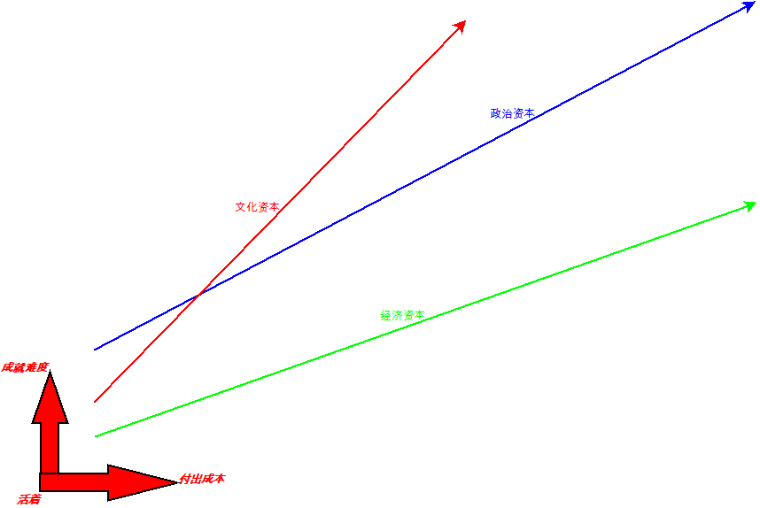

# 2020-07-15

**从经济，到政治，再到文化资本**

小时候很晚才感受到钱的重要性，真正感受到的是进入小学后，一路回家的有一个同学，郭，他爸是一个小水泥板的合作人，出车祸死了，他就在财务上有了自由，相比之下，才能知道零用钱的差异。

进入高中后，就读的是荣昌永荣矿务局的永荣中学，原来是矿务局子弟校，有同学家庭好很多就很正常了，当然他们的父母也会给他们安排了，高中时体育老师李强就让人知道关系的重要性，他的得意门生是入党积极分子，那时才开始对政治有种摸不着，但是绝对羡慕的份。

最近听到文化资本，讲经济好了的家庭为什么会给孩子培养琴棋书画之类的，说是把经济资本转移到文化资本，那一刻我非常吃惊，我以为的有文化人都是一种修养，是一种精神领域的扩展，可见我理解还是比较粗浅，没抓到本质。而抓住的那些观念影响我至今，就像我一直按一个少爷的心态来活着，可是家庭与周围的环境却都是小农心态，这让我回老家也是很不舒服的，回家找不到共同语言，发小都已经完全走向了我所深恶的那种人了。

上图算是我对经济、政治及文化资本的理解。从活着开始，一生下来就是为了活着，在到达一点的经济基础后，慢慢地开始政治与文化的接触，为什么把政治放在文化之前？侠义上来看政治是涉及官场，我现在看来，更在意的是广义上的政治概念，现实生活中的人，与父母，与亲朋好友、同学、陌生人等接触过程中就会产生政治意识，毕竟群体生存的基因至少长达几千上万年！

其实文化也是混杂在日常生活中的，至少大家没有注意到，没有刻意去思考这就是文化，通过积累文化也会产生资本，大家很抽象，可是当你看到每一个能人时，你会不会意识到这就是文化资本的结果呢？比如一个木匠吧，大家都会找你去做木工，就连黑白喜事都是如此，你也会去挑选别人；再往上层走点，来到娱乐、体育、演唱及琴棋书画，为什么很多人要去关注这些呢？就回到最后质问了，人活到死最大的目标是什么呢？找钱？结婚生孩子？其实大多数人过得并不好，债台高筑，基本没有像样的精神文化生活，一些朋友出来吃个饭就是一种重要的社交。大多数人不会去也没有能力反思自己的生活遭遇的原因，大家都生活在被谎言欺骗，如果我去捅破，会让大家难堪，也让大家失去自尊，慢慢地我就无语了，笑笑，默默地吃饭即可，这种环境下才能体会到思想就是如果内裤一样，你没有超人的本事时，切莫乱开口说出真相，说出大家的恐惧来！

但缺少文化资本的人，又往往是创造社会财富的人，他们的生命价值体现在对妻儿的负责，挣钱养家就是最大的人生价值，天气好了就去干活，天气不好那就呆家里休息，他们有可能一夜暴富，也有可能一夜破产，失去妻儿都有可能，这时才能感觉到就想动物一样繁衍生息了，大自然的不确定性就想他们的运气那样，有大起大落才是他们的想要的，他们就像浪花一样，起伏很快消失也很快，但是不再是浪花时，那时他们就认命了。

想起了要放羊娃的那个循环问题，放羊娃的故事：

记者A：干嘛呢？放羊娃B：放羊。

A：放羊干嘛？B：赚钱

A：赚钱干嘛？B：赚钱盖房。

A：盖房干嘛？B：娶妻。

A：娶妻干嘛？B：生娃。

A：生娃干嘛？B：放羊。

把这个放羊娃的故事套用在工人身上，多么类似呀，进工厂，找钱，娶妻，生娃，再让娃进工厂工作。如果说一个人有目标，那么几千年的先贤们还没有思考透彻吗？说实在的我也不知道用什么理由来解释这个了，我也迷糊了，但记得看到过一句类似的话：庸人传宗接代，圣人改变世界。我自认为成为圣人我没那个条件，比如懒惰，智商不够等；庸人似的生活我早已远离，早已理性到如一个机器了，非要有一个标签来给自己的话，那就是只能算是一个旁观者啦！
