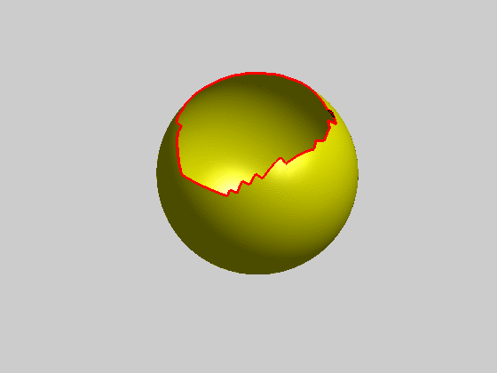

# 图形学研修班

## 2022-8-09 10:00 星期二

Lecture 11 Mesh Processing

以三个方向为介绍对象
mesh smoothing
mesh subdivision
mesh simplification
里面还是在讲解一些算法，以数学知识为背景，在其他听课人的额状态来，多数人还是听不懂，下一步找到应用场景用一用。
这次的轮廓介绍让自己有了大概的了解，解惑一些问题，其实我对如何把数学公式换成代码的逻辑还是有种认知障碍，缺乏一定的基础知识认知。对算法的认知也是有一定的误解，想起当年在学习时，院系的那个老师说的那句话了，一个简单的数学公式都不能编码出来，需要来干什么了！

这培训下来，感觉三维图形学的内容就是那些，一扩展就是其他领域的知识，但是领域内的知识也是很难的，很多知识点都是别人的库写好了，直接调用就过了，那种全局观也不够，自己的知识点差在那里了？就像现在手上的一个逆向别人框架的东西，现在还没有吃透，很多内容也不知道是如何完成的细节，让人汗颜呀。

## 2022-8-02 10:00 星期二

Lecture 10 Models from Point Clouds

得到点数据基本都是从一个方向获取的，要得到立体的就需要很多方向的数据，相邻方向之间的旋转角度还需要考虑误差。
这就涉及到配准，以ICP(Iterative Closed Points)主流通用的算法来讲解了过程。
配准的思路就是形状大致相似，考虑通过旋转R和平移T来让两个形状重叠，得到这个R和T的数据

对齐拿到一个整体的点云后，如何把点云变成面，是另外一个技术点
从隐式与显式函数构造几何数据来谈，构造模型的最好方法就是隐式。
显式：噪音数据影响太大，点直接相连构成的拓扑结构太复杂，无规律没有解决方案
隐式：通过估算与逼近，以大多数数据为考虑，对少数噪音数据无感

这里介绍隐式与显式是代数上的计算，以前不太明白为什么强调隐式与显式，以前就喜欢显式的，因为觉得那个是确定的，自己照搬依葫芦画瓢就可以了，现在才明白隐式的重要性大于显式的。

使用SDF(signed distance function)基础昨晚算子来获取更好的iso-surface面。
在去计算normal就得到一个surface的信息了，就可以渲染了。

三维补洞算法-径向基函数RBF(Radial Basis Function)

想想整个课程到现在，很多知识点的串联起来，让我有很大的感受，别人拿出来的每个例子，为什么都做这些一样的demo展示，那是因为有原因的，因为别人的研究到这个地方了，我就是站在外面看到了皮面上的东西，让自己兴奋的去学习，可以说是杂乱无章的，现在这个培训下来，很多东西都比较清晰了，能慢慢地去琢磨重点是什么了。

## 2022-7-26 10:00 星期二

Lecture 9: 3D Scan
在图形学中渲染模型的来源是多种方式，今天以扫描为主，讲解了以结构光构造的数学模型来重建3D场景对象，最后以Kinect为例举例说明。

Kinect是2010年发布，2012年发布的Kinect for Windows，当时的研究生图形学课程还是比较前缘的了，当时2016在七腾参与的3D建模人体数据也是应用了这个技术，这个让我对技术认识感觉到非常的感叹，当年领导也是处理这个的，这么多年了我的图形学还停留在什么地步牙，令人感叹。
还有两节课就完成，点云处理和mesh重建两节课了。下面两节课应该是核心课了，其他都是前提与基础，后面两节课的内容才是本次培训的核心吧！

## 2022-7-19 10:00 星期二

Lecture 8: Models generation from 2D Images

从single frame中一点点patch后，combine得到3d model。其算法的核心是
1.feature-extruact提取特征点；2.correspondence对应关系

有两类的方法
基于双目视觉构建，是epipolar geometry原理的处理。
基于光照构建，可简单看成渲染的逆变，是intensity灰度值的数值处理过程中

这一节课解惑了很多东西，特别是这两个方法的概念让我对很多事情有了更深的认识，图形学方面的很多东西都存在联系，但是之前一直简单的在一个渲染的范围内，而且不考虑任何数据的来源，只是以调用图像api渲染出结果为目的，现在的视野一下子开阔起来了。

epipolar geometry
对极几何（Epipolar Geometry）是Structure from Motion问题中，在两个相机位置产生的两幅图像的之间存在的一种特殊几何关系，是sfm问题中2D-2D求解两帧间相机姿态的基本模型。

参考书籍
Computer Vision: Algorithms and Applications

## 2022-7-12 10:00 星期二

Lecture 7： Models generation from 3D Volumes
3D的数据可视化的目的很容易达到，那是因为人眼对色彩的变化足够敏感。但是没有网格，后续应用是受限的，仅仅达到了可视化而已。

先从简单的2D开始，图像二值化后得到一个图像，这种判断阈值的方法与像素本身都是离散的原因产生锯齿感很强的数据，得到不平滑的结果。网格就不一样了，可以继续细分下去得到满足精度范围内的平滑，而且渲染的光效也是很好。那为什么不使用样条曲线来表示呢？连续与平滑都能满足更好的结果，理论上样条函数的操作是可行的，过程非常复杂，不太使用工业应用。

iso-contour等值线2D与iso-surface等值面3D
如何确定点与线？满足那些要求？
closed孤立性，分内外 >0,=0,<0
orthographic to gradient direction等值线与梯度方向垂直
manifold流形
non-intersect自相交
这是都是满足好的逼近的属性good approaching

首先输入，从grid(uniform size)上划分区域，在grid的基础上取提取相应的点线信息。
有两种方法
marching square2D/cube3D, 提取的顶点vertex在grid edges上
dual methods，提取的顶点vertex在grid cell里面
都会通过插值去取最接近的点，具体的细节需要可查阅相关的资料。

这样得到点线信息是构成网格的基础，有了网格基础就可以做其他渲染与有限元等更加丰富的应用了。

这节课带来的视野是开始对整个图形学的应用有了更加基础的认识了，也理解了很多那些看起来很炫的东西是如何生成创造出来的了，同时这节课也给我可以拓展自己在图形学上的兴趣了，可以找很多相关的开源的东西来研究了，算是我真的有了一点点入门的感觉。现在我理解这门课是高级研究生的课程了，很多知识点不再是书本上那样的一章章的逻辑，而是更接近生活实践需要，理解了很多人要去读好的学校了，但是读好的学校也要读得进去才行。

## 2022-6-28 10:00 星期二

Lecture 6: Volumn Rendering

体绘制，数据来源可能有两种，一种是2DArrayTexture，一种是3DTexture
渲染这些输入得到的是一个图像，所以首先要slice，得到一张张的slice后的图像，把他映射到屏幕或文件上就是结果

体绘制的过程中，是没有几何结构，就是没有surface，就是利用iso-surface得到一个平面，从视角方向得到的这个图像。

Ray-tracing是多次迭代、反射的过程，
Ray-casting是一次性的

根据上面的理论可以得出不同的方案来处理体绘制
1-first：取第一次相交的结果为值
2-mean：平均值，在相交范围内取平均值
3-MIP：最大值，在相交范围内取最大值
4-accumulate：累积结果，把相交范围内的值都累积起来，做区别对待。

把体绘制与光照结合起来，又是对结果的改善。

## 2022-6-20 10:00 星期二

Lecture 5: Ray Tracing

direct illumination vs global illumination
ADS(kaIa + kdId + ksIs) 是直接光照，A(DS)*
global illumination是ray tracing实现的

因为光线追踪的起始位置Lighting Position与结束位置Eye Position是确定的，其途径是由diffuse和specular影响的，可用L(D|S)+E来表示，

图形学的核心就是3D投影到2D的过程，ray tracing是2D到3D的逆投影。因为最终得到的图像是确定大小的，这样的计算量就可以得到简化。

为了简化，从lighting到eye是以一次性反射或折射计算的。
### compute ray
通过图像像素反推算ray line, 得到ray=p+td。
多数情况下需要分正交投影与透视投影来计算ray
### determine first point
确定求交的第一个点，可判断是ray-sphere,ray-box,ray-triangle这些情况来分来
### calculate color
用shading计算出相交点的color值，但是为了更精准的值，需要进行对简化的模型进行迭代iteration和recursion操作，这些就是工程上的考虑与对需求结果的要求。

## 2022-6-14 10:00 星期二

Lecture 4 ： 3D Viewing, Lighting and Shading in OpenGL

因余老师出差，推迟到今天，在美国时间改成上午。
今天有几个点的概念清晰起来了。
一个是平行投影，正交投影是平行投影的一种，是顶点vertex垂直于viewPlane的结果
透视投影是converge point与顶点vertex连线，与viewPlane相交点就是结果。

lighting model是着色过程，是3D space中的着色
surface rendering是把3D space中着色的颜色值投影到2D viewPlane中，是一个3D to 2D的process过程

flat shading是一个triangle with one normal with one color in triangle
smooth shading是通过插值来完成的（使用barycentric coordinate重心坐标）

## 2022-5-27 16:30 星期四

Lecture 3 ： Introduction to 3D Printing

关于3D打印的理解，从工艺上来说，有很大的前景，相比现在的subtractive工艺，需要膜具，整个产品的投入非常大，制造出来的也是模板下的东西。现在3D打印可能才是工业4.0的核心瓶颈。
加上前段时间对老婆汽车行业的一些观点看到，中国的汽车已经属于饱和状态了，可见这些技术未来的含量有多重了。

## 2022-5-24 16:30 星期二

Lecture 2 ： Object representation

关于rotation中的3+2+1中的2，可以参考极坐标中表示球时，用两个角度来描述一个球面点，这个点的球半径就是一条向量，也是二维的。

manifold流形，可以光滑、连续、无缝地投影到平面的一个小邻域内的图形。其他就是非流形non-manifold

样条
插值，一定经过所给点，分内插值与外插值
拟合，不一定经过所给点，
样条基本都是不超过四次多项式，超过四次的多项式波动很大，在实际中没有多大的实际意义
那如何描述一个复杂的曲线了，就是分段，对曲线分成多段，通过连接这些分段片组成一个复杂的曲线。
连接这些分段时如何保证样条的连续性、光滑性了？
C0第一阶求导后的连续性
C1是法线方向一致，即曲线的方向要保持一致
C2是曲率一致，比如一大圆弧与一个小圆弧连接线重叠，只能是C1连续，C2不连续，因为它们的曲率不一致。

cubic-spline是至少C1连续的，C2的连续性就需要根据实际情况来判断了。

## 2022-5-19 16:30 星期四

Lecture 1 ： Geometric Transformations

参加公司的内部培训图形学，第一堂课是关于transformation的，与看过的没有多大的区别，
但是余老师解释旋转时需要6位，即加工业要解决的至少6轴旋转技术也是这个东西，余老师从正方面解释了六轴
3+2+1解释为一个空间点3维，一个轴向有两个平面确定2，一个旋转角度1
反向解释5维，两个点各需要3维，共6维。但是这两点的连续是一个具体的长度，这个维度是不需要的，可以减去一维，就得到5维，加上旋转角度这一维。

# 参考资料

[Ray Tracing in One Weekend—The Book Series](https://raytracing.github.io/)
[introduction-to-ray-tracing](https://www.scratchapixel.com/lessons/3d-basic-rendering/introduction-to-ray-tracing)