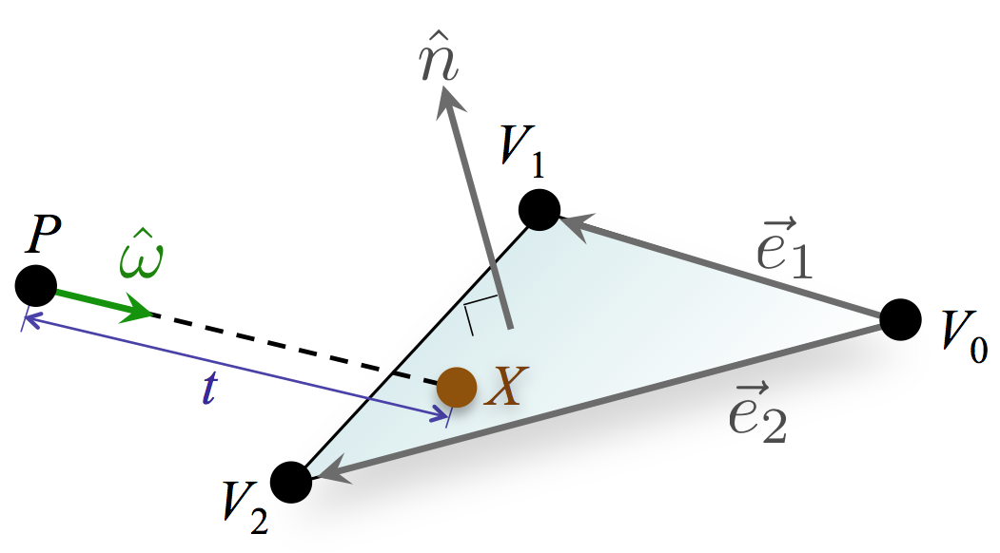

# [Graphics Codex](https://graphicscodex.courses.nvidia.com/app.html)

## [Surface Geometry](https://graphicscodex.courses.nvidia.com/app.html?page=_rn_surfc)

1.What is surface?

The Speeds of Light

Surfaces and Interfaces

2.Modeling a 1D Surface in 2D Space

A Surface is a Set of Points

Implicit Form

Explicit Form

3.Triangles Meshes

A Triangle

Triangle List

Indexed Triangle List

## [A Model of Light](https://graphicscodex.courses.nvidia.com/app.html?page=_rn_light)

1.Digital Images are Measurements

2.Rays of Light

Transport Paths

Vectors

Unit Vectors

3.The Light Field

Light is Conserved Along a Ray

Assumptions and Simplifications

## [The Rendering Equation](https://graphicscodex.courses.nvidia.com/app.html?page=_rn_rndEq)

1.Radiometric Units

Photon Energy

Power

Irradiance发光 and Radiosity热幅度

The Measure of a Set

Radiance

2.Measurements in Different Frames

Vector Dot Product

3.The Rendering Equation

Rendering is Very Hard

## [A Camera Model](https://graphicscodex.courses.nvidia.com/app.html?page=_rn_camera)

1.Images

Images are Everywhere

An Apterture Selects in Image

2.The 16th Century Mechanical Renderer

3.A Modern Computational Renderer

1.Load a Scene Data File
open assert import library or tinyobjloader
data driven, avoid hard-coding the scene program

2.Measure Incident Light at each pixel
the heart of the renderer
a.Find (by ray casting) the point X on the surface that scattered light towards P
b.Switch from incoming to outgoing light
c.Estimate emitted radiance
d.Estimate scattered radiance

3.Adjust dynamic range
we have limited precision in digital representation, as:
1) can only sample discrete frequencies of light
2) choose three frequencies that span the visible spectrum(RGB), and hope they representative of other frequencies

4.Save or display the result

4.Primary Rays from Pinhole Camera

5.Dynamic Range

Displays aran't capable of producing arbitrary intensity ranges and light frequencies
tone mapping, most of tone mapping algorithms are complicated and not particularly effecient.

Gamma Encoding

Bloom
The optics of real eyes and cameras are imperfect, and very bright light tends to blur out as it passes through the lens, producing blurry halos around bright objects. Bloom is the computer graphics trick (that artists have long employed in natural media) of blurring very bright objects slightly to give the impression of a bright stimulus. 

Desaturation

## [Ray Casting](https://graphicscodex.courses.nvidia.com/app.html?page=_rn_rayCst)

1968年的第一篇论文不仅是检测objects的位置的，还是用ray casting来渲染

1.Ray Casting Algorithm

2.Ray-Sphere Intersection

3.Ray-Plane Intersection

4.Ray-Triangle Intersection

Unit Triangle
把点放在每个轴的单位1处，这样得到的三角形有一个性质，相交点是三个点的一个权重，把这个推广就是重心坐标系了。

Barycentric Coordinates
We can write any point in the triangle (or the plane) as such a weighted sum of the vertices. The weights from a 3-vector, which is called a barycentric coordinate.

Arbitrary Triangle

Vector Cross Product

Triangle Mesh

Some Performance Considerations
A spatial data structure is a tree or other data structure designed to exploit spatial relationships between elements to support operations like ray casting in faster than linear time.
As a final note on performance, observe that ray-triangle intersection is actually more expensive than ray-sphere intersection. The intuition for this is that a sphere is a geometrically simple shape because it has a simple equation. The triangle is relatively complicated. 

5.Visualization for Debugging

Texture Coordinates
The texture coordinates are only specified at vertices, however we need the mapping to be defined at every point on the surface in order to determine which part of the texture map to use to color each point. We need a way to smoothly and linearly interpolate texture coordinates specified at vertices over the center of the triangle. Recall that any 3D point on the interior of a triangle is a weighted sum of the vertex positions, with weights given by the barycentric coordinates. Those coordinates also vary linearly over the triangle in 3D. We can compute a weighted sum of any vertex property to interpolate it linearly over the triangle. This is the third promised beautiful application of barycentric coordinates.

Stepping Into One Pixel

## [Direct Illumination](https://graphicscodex.courses.nvidia.com/app.html?page=_rn_dirctIllm)

illumination emitted from the light sources directly into the camera, and that direct illumination scattered into the camera together account for the highest-magnitude terms in the Rendering Equation

1.Radiance is Conserved Along a Ray沿着射线走的辐射是守恒的

2.Direct Illumination

3.Scattered Radiance散射辐射

Biradiance

Implementing Point Lights

4.Shadows

The Visibility Function

5.Ambient Illumination

## [Material](https://graphicscodex.courses.nvidia.com/app.html?page=_rn_matrls)

2.The BSDF(bidirectional scattering distribution function)
Lambert's Law
3.Scattering Functions
common terms

[origin scatterning terms](https://graphicscodex.courses.nvidia.com/diagrams/scatteringTerms.png)

The names in the diagram are drawn from modern physically based rendering and
physics, in which precise scattering terminology is important. Beware that it is common to casually apply imprecise phenomenological graphics terminology from the 70's. This occurs primarily in the real-time rendering/games community. For example, in that community, **specular** means glossy, **diffuse**  means Lambertian, and **reflection** means mirror.
不同时期名词的概念是有差异的，早期的概念都是简化的，随着发展概念就越来越细化了。

Mirror Reflection

Implementing Impulses脉冲的实现

Transmission and Refraction

microfacts

Lambertian Reflection

The Fresnel Effect

4.Partial Coverage

Compositing

Alpha Cutout

Perceived Color

## [Rendering Algorithms](https://graphicscodex.courses.nvidia.com/app.html?page=_rn_survy)

Rendering is equivalent to measuring flow along paths through an (infinitely complex) light transport graph.

1.The Transport Graph

To abstract the scene into a transport graph. The nodes of this graph are points on surfaces at which light is emitted, scattered, absorbed, and measured. Nodes that emit light are sources and nodes that absorb light are sinks. Edges are line segments along light rays between the points represented by nodes.
Light transport paths are paths through this graph.

2.Path Notation

Path notation describes classes of light transport paths and subpaths using regular expressions/grammars. It is primarily used to discuss strategies for sampling those paths and does not directly manifest in a software implementation.

Node Types
Luminaire光源
Specular反射
Diffuse散射
Eye

Operators
就像正则表达式一样，用Node来描述Path

Notable Phenomena

The two most commonly recognized phenomena cannot be neatly described with path notation: shadows and highlights.
Path notation can't describe this for two reasons. First, it depends on many paths and the notation is for describing a class that a single path belongs to. Second, it is a relative way of describing illumination and path notation is absolute.

3.Direct and Ambient Illumination

4.Whitted Ray Tracing
Whitted ray tracing extends direct illumination and is built on recursive ray casts. Path tracing, bidirectional path tracing, and photon mapping all continue to extend this approach, which is currently dominant in realistic rendering.

5.Path Tracing

6.Bidirectional Path Tracing

7.Photon Mapping

8.Radiosity光能传递，热辐射

[Bidirectional Path Tracing](https://www.cs.princeton.edu/courses/archive/fall03/cs526/papers/lafortune93.pdf)

## [Numerical Calculus](https://graphicscodex.courses.nvidia.com/app.html?page=_rn_int)

Calculus is a core tool in computer graphics across not just physically based rendering but also other areas such as animation and geometric processing.

1.Definition of a Derivative导数的定义

2.Numerical Differentiation

3.Definition of an Integral

4.Analytic Integration

5.Numerical Integration

6.A Tale of Two Cities
Most problems in applied computer science are today solved by randomized algorithms, also known as nondeterministic and stochastic methods.

7.Monte Carlo Integration

8.An Energy Example

## [Path Tracing](https://graphicscodex.courses.nvidia.com/app.html?page=_rn_path)

1.A Simple Implementation

2.Algorithmic Complexity

Elements of Path Tracing

3.Applying Monte Carlo Integration

The Camera Intergrals
Pixels of an image represent energy that accumulated on a square area from light that passed through a camera aperture over the exposure time. Therefore, the units of a high-dynamic range (monochrome) virtual image pixel are joules. 

Distributed Sampling

The Transport Integral

Terminal Cases

4.Importance Sampling

## [Ray Marching](https://graphicscodex.courses.nvidia.com/app.html?page=_rn_rayMrch)

1.Intersection Algorithms

Ray Marching
is an algorithm for numerical estimation of arbitrary ray-surface intersections

2.Marching

3.Distance Estimators

4.Sphere Tracing

5.Some Distance Estimators

6.Computing Normals

7.A Sample GLSL Ray Caster

8.Operations On Distance Estimators

9.Some Useful Operators

Union
Intersection
Subtraction
Repetition
Transformation
Blending

10.Increasing Performance

Over-Relaxation
Bounding Spheres
Reintroducing Analytic Roots
Other Optimization Strategies

11.Some Online Examples in GLSL

Educational
Aspirational

12.Further Reading

## [parallel architectures](https://graphicscodex.courses.nvidia.com/app.html?page=_rn_parallel)

1.SIMD

2.Coherence

3.Memory Coalescing

4.Cores

5.Thread Pools and Megakernels

6.Occupancy

7.Synchronization

8.Pipelines

9.Physics Revisited

10.Super-Linear Speedups

Intra-core Utilization
Memory
Physics Revisited

11.Structure and Arrays

## [The Eye](https://graphicscodex.courses.nvidia.com/app.html?page=_rn_hvs)

1.Photoreceptors光感受器

2.Photoreceptor Response

3.Photopic Vision适应光的视觉

4.Scotopic Vision适应暗光的视觉

