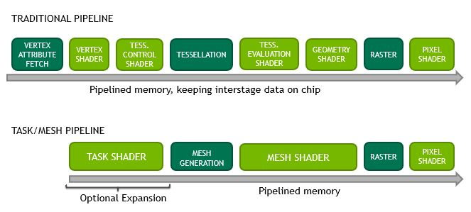

# 学习计划

## 编程语言

- [C&C++]()
- [ECMAScript]()
- [Python]()
- [Rust]()

## 图形学

### 3D API

- [Transform]()
- [OpenGL]()
- [Vulkan]()
- [gpuweb](https://www.w3.org/community/gpu/)

### Shader

着色器

- [Traditional Pipeline]()
- [Task/Mesh Pipeline](https://developer.nvidia.com/blog/introduction-turing-mesh-shaders/)

#### 相关文章

- [Nvidia Turing GPU 光栅化管线中的全新渲染技术](http://on-demand.gputechconf.com/gtc-cn/2018/pdf/CH8801.pdf)

## 软件工程

### 设计模式

Design Pattern
