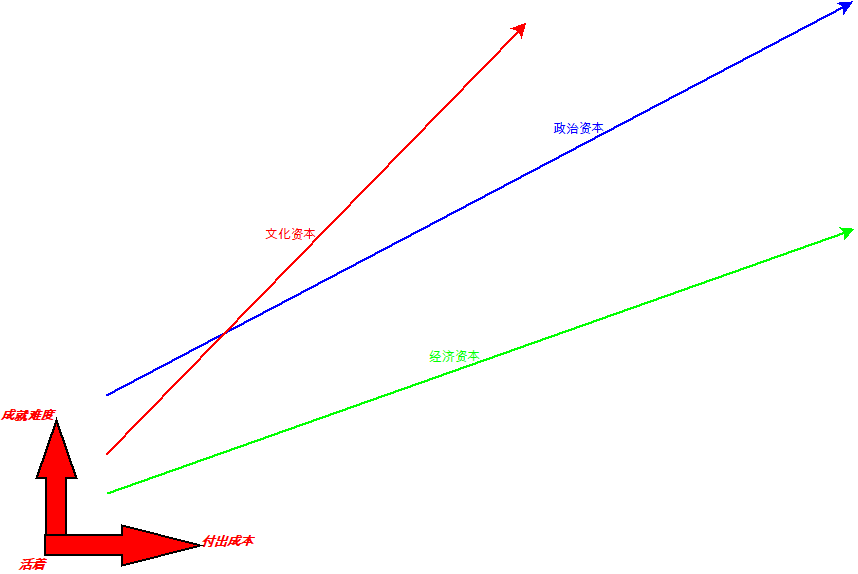

# 2020

## 2020-08-02

**不啊也啊**

这四个字来自一个视频，关于解读阿城的《棋王》中的一次词。类似大海啊，全是水；骏马啊，四条腿。这就是常见的普通人的文采了。从小学开始写作文，就是从流水账开始，老师强调要真情实景的描述。对于小学生而言，没有足够的词汇量，就是那些词用来用去的，使用感叹语气助词就是必然的，不是选择，而是无奈。

不啊也啊，说的是不用感叹语气助词，通过文字能感受到有语气助词，这看似很简单的，做起来很难，能达到这个准则的基本都是优秀作家，那些真的用词简单，用非生字，一见就能感受到作者所表达的含义。相反的，就是真正的流水账记录了，如今天我放学回家，在路上高高兴兴地往家走着，很愉快的就到家。但是会有字数限制，过短就需要凑字数，怎么凑呢？在这样的状况下，回家路上没有故事就需要编造，虽然小孩子说谎是具有本能的适应，可是这种情况会持续几年，从小学到高中达十年以上的重复说谎，可见能从中走出来的人说谎能力都不弱，虽然不知道别人是否识破。

上面解释清楚不啊也啊的含义，现在来分析一下实际生活中的场景，什么长都不如家长这个身份，就从家里说起。我家就属于那种话语比较少的那种，谈论的话题也很闷，全是父母提出，且都是拿来说教之类，他们在感叹他人的厉害同时，把希望无声地加在了我们身上，如果我这时说他们这样做的弊端，老妈会说我们都是为你好，除了我们还有谁这么关心你呢？我能理解他们的能力范围之内的事，可是彼此沟通时就会出现这样的问题。

再来说说达十年以上的初等教育，以现在的眼光来看，我小时候更应该努力读书，在一个环境中会造就不同的人，这一点我是深有感触，就从不同的时期的同学来说，在之前还得谈谈同村的小伙伴。从小的印象中，我在外婆家的印象多于老家，这一点算是一个无奈，爸妈的抚养能力很难一下子对两个孩子进行抚养，而且那个靠种地养活的时代，至少爸妈是没有外出打工的经验，都是做小工，没技术含量，在那个外出打工的红利中，他们完全是无缘其中。他们还一直生活在他们受苦受难的时期，文化革命就是他们成长的年纪，加上爷爷是流浪到此的，没有人缘关系的红利，我与周围的伙伴也是很难相处的，毕竟受外婆家的影响，再回到老家时，我就更加孤独了，因为外婆家与隔壁也是有很大矛盾的。

说小学同学，就不得不提秦定斌和郭方彪，最后都是不再有任何联系，前者是父母在外打工，但都是那个浮躁的年代的人，并没有赶上时代的步伐，作为独子的他走上小混混的模样了；后者的父母算是小康，可他父亲在小学时意外伤亡，他也走向了不同的路。而那样两位老人，爷爷与外婆先后去世，对我的影响最深刻，让我失去了享受隔代长辈的教育了，在那个懵懵懂懂的年纪就这样使我陷入了封闭状态。

初中同学，算是同学中比较稳定的了，一是都是一个镇上的，二是大家都是差不多的环境，当然都比我要好，至少父母层面的眼界要好，当别人都在规划孩子的未来时，最大的感受就是初三时语文老师把我们几个可能考上县上重点中学的同学拉去做思想工作时，我能从同学与老师的交谈中得到对比。那时，我总是无意参与对比，老师的期待之类的，同学的攀比之类的，都让我很无奈，我至少没有完全走出小学封闭的状态，说实在的，初中的同学我更多的时候是作为被动的参与者，初中是我自己定义的最糟糕时期。

高中算是最好的年纪，在一个永荣矿务局子弟学校中读书，后来不再只招子弟学校了，扩招的结果吧。特别是第一学期的入了前五名，无名有幸去了元培班待了一学期，这个学期对我来说是人际圈，家庭对比这方面的影响最大，才能更加知道同学的父母为此做出的决定。虽然最后元培班没有继续下去，我又调回了原来的班，我的错误就想小时候，从外婆家回到老家一样，格格不入再次体现出来了，是否命运总是喜欢给我这样玩游戏。最可怕的是，我的成绩一落千丈，不再享受优待的资格了，可高考我又进入了那一届的前五，勉勉强强地上了一个二本。可见学习这个圈子还是太小了。

进入大学，到大学退学，这是我目前独自做出最大的选择。关于做出这个决定，算是我思想上的独立吧，很多人不理解，特别是我周围的人，家人和同学。这里说说大学同学，有部分同学是重点中学中的淘汰者，而我是普通中学(县上四个中学，排在三四位上)向上刷选出来的人。从参加军训后，班级里面就一直在发生变动，才知道有哥哥姐姐们的好处，他们能把之前学校的那些事儿灌输给你，让你对学校的机制有更好的了解，在口才与见识见解上，我是被甩开一条街的，我的专业是计算机科学与技术，可我入门时还需要学敲键盘，而他们都是玩游戏的高手了，上课还能跟老师玩老鼠耍猫的优秀。如果是这样的也算了，而我却不幸见到了教师队伍中的不合格者，当时上机时，老师明着对学生说补课的事情，让我对大学完全产生另外一侧解读，与村里的那种人际关系并没有实质的变化，至少不能算是高等人才教育吧，算是初等教育下的扩展。刚说的变动是，一学期不到，转专业的人很多，且基本算上班干部，才明白当上班干部和社团搞好关系，转到学校的好专业是一条路子，至少当我得知后才能惊怪吧，开始有人身体不合格休学了，开始有人退学回家做生意了，大学两年半的经历比起我之前的人生经历都丰富，这也是我最后离开学校的原因之一。

进入社会，我算是从底层做起，端盘子开始。可是还是会发现一个怪现象，我没法很好的融入一个圈子，注意是圈子，不是团队，当然经历的团队我心里都是算不得上好的团队的，各种原因，我也一如既往的做自己，并没有改变任何，可是社会给我的教训也不少，成长就是必然的要付出代价吧。

不啊也啊说的是文学上的，我却扯这么远，最根本的问题，文化修养是如何培养的是怎么，最近学车，好奇很简单的事情，为什么很多人都会出错，选拨就是那么无意的产生了，为什么别人总是如此容易就过了刷选了，就像再难的题，考满分的也是有人的。这个逻辑太普通了，混迹于日常中，让人无可避免！

## 2020-07-26

**新贵没文化**

这期的话题是受一个视频，标题是“美国：我没苏联有文化可咋整？CIA：文化？那我来重新定义一下文化？”，其中说到美国兴起的抽象表现主义的艺术感！是的，美国在经济上超越欧洲后，也算是一个新贵，缺乏文化修养。在二战后，美国为了打破欧洲的殖民主义的影响力，推出了独立自由的概念，让自由独立在每个民族心中开花，这样欧洲的影响力就很快受到民族的反抗，而艺术，抽象表现主义也是一个类似的操作，来达到了最终的结果。

默默的支持，阳谋的结果就是大家都对他们有好感，可是抽象表现主义至少我现在还是非常欣赏的，自由的绘画的抽象结果，通过表现主义展示出来，让每个人都感觉自己可能自由的获取到成功，却不知道自己是默默地被捧的逻辑，而自身又表现出反抗对自由的约束，也许这就是所谓的自我错觉非常美好吧。

近期也看到李敖的一句话：别人说你是王八蛋，可我能证明你就是王八蛋。这句话的逻辑很让我思考，加上上面的场景，感受到那种不同观点下看问题的思路是多么的重要，为什么别人说着同样的话，却能拼凑出不同的观点，这个让我自从知道了概率后，就一直没想明白的，大家都说同样的话，都是同样的文字，我能听懂，可是为什么我想不到这样的思路呢？我为什么走不出大众观点的约束呢？

如果有一句话能释放心中的疑惑，那么无疑就是：新贵没文化了。想美国这样，一个国家要跨越到强国，也需要文化影响来塑造价值观，美国的历史短周，是通过超强的支持文化走出了一个强大的世界霸权，至少必须强于现有的，才能进入上层，才能拥有话语权。

国家都如此，国家中的一个家族必然如此，家族中的一个人也必须如此。与前面的疑惑，为什么我说不出另类的观点的思考加在一起，就让我对文化的理解，已经脱离了狭隘的知识者这个身份，更多的在于对文化的理解，见解。

可是这里，我没法对文化下定义，一是自身的知识眼界窄小；二是人生经验也不够丰富；三是我还属于一个人的世界。可是让我思考到这里的这个过程让我非常诧异，我开始对文化本身感兴趣了，不再是对文化衍生出来的附加品感兴趣了。
## 2020-07-19

**Developers can't fix bad Management**

最近看观察网的视频中，听到有三个词来描述：科学，工程，工艺。非常符合工业党的思维，我自己理解这三者之间的关系是：科学是理论基础，这个现在是最容易得到的，成本算是最低的了；工程这块比较难了，在弄懂了科学之后，是需要一代人，需要上下游才能促进工程文化的提升；工艺这块就是特定需求造就的，就是事成人的那种，就像尿不湿是航天发展所带来产品，以前就是一块布，而能发展到尿不湿的这种工艺可见过程是多么离奇的。

标题来自引用文章1处，文章有一个观点，就是丰田制造如何进入了美国市场，并教训了福特一下，背景就是福特正在赚钱，觉得并不需要改变，直到丰田吃掉较大的市场份额时，他们才意识这个问题，老板只是简单的要求经理如何做的好，这就是会计与销售会在传统大公司高层中任职，这些经理都是抽象的考虑改进，并把想法推到员工身上，但又不希望那些工作的人能够了解优化制造流程，而员工就只想当一天和尚撞一天钟，大家都维持现状，并不想做任何没回报的逻辑，这就是所谓的管理行动造成绝大多数的问题，而软件工程中也面临这个问题。

既然说到员工就是一个当一天和尚撞一天钟，回过来思考一个问题：

普通学生与考清华北大的学生有什么区别呢？曾经就像公知所描绘的那样，你要这样那样才能考上清华北大，这就是屁话，一个智力、见识、家庭、意志力及见解普都普通的人，没有超越普通人的地方，能考上吗？如果你都能考上，那不就说每个普通人都能考上了？这是我曾经问自己与那些人的差别在哪里，想了很久的问题，至今还没有一个总结到我满意的答案，也许就是我没有突破到非普通人的地步吧

再反过来思考，教育就是为了选拨人才，会付出各种成本，隐性成本早就超越普通人的承受能力了，大学教育是为了就业的，如果你仅仅使用分数上了清华北大，也只是作为陪衬的角色而已，这也是当年有一篇文章影响我至今，为什么北京本地人在毕业后比大多数人都有更大的成就，是在各个方面，包括学术方面。

如果说高考是一个可以跨越阶级的方法，那么还有一种方法也是对农村孩子有很大的诱惑：那就是军人，觉得参军后如果能想办法留下了，也是通过送礼来达到目的。可是想过没有，特种兵与飞行员是怎么来刷选的呢？肯定不会是从这些普通兵中遴选吧？

前面只是说明员工的价值，如果一个员工的价值太普通，作为管理层所发出行动都是白费的，就像一个普通人肯定考不上清华北大，家长再怎么鞭笞也不能改变结果。

这就是小公司局限性，招不到好的人，从好的人才来说，他为什么会选择小公司呢？小公司中层的的管理策略也是参考大公司的策略，看别人的自传之类的来充实他们的管理知识，可惜员工太普通了，大公司那种压迫的承受能力肯定比考清华北大更难。小公司管理策略中如果缺乏信任，那么就存在着不确定性了，承受不了的普通人会离开，或许这才是最好的选择。

以前会思考为什么我做不出来的题别人能做出来呢？在我读书的周围当中，我没有遇到天才，大多数的人是见识或看过某本参考书的解题思路，以前我会怀疑自己的智力不够高，现在看来是我的见识不够广，思维局限性太多，很容易让自己陷入某个逻辑陷阱不能自拔。

现在我也是处于这样的状态，我会思考一个让我很纠结的问题，为什么那些牛人写的框架，写的业务就那么清晰呢？别人分析业务的文字是那样清晰，可是一旦我在实际工作中，就没法写出来呢？我站在一个库的作者来分析时，会发现我很难抽象到一个单一的逻辑上，很多时候的业务真的是不清晰，如果我想要清晰的结果，管理层会给吗？

上面的假设又回到一个问题上，似乎站在一个好的平台上，就能发挥自身的潜力的逻辑了。可是会发现大公司出来的人也很多，他们会去小公司，会去做培训，拿着曾经的资历来给人渲染可能的结果，可以认为他们是被淘汰的那批人，但是他们有区别于普通人，他们都没法在那种环境中混下去，却给普通人描绘如何进去工作。

现在才理解那篇文字中说的，如果使用大量的螺丝钉，没有管理层与底层的互动反馈，即不动态的改变，那么多大公司为什么每年也会走出很多人，保持公司的人才流动才是大公司的一个关键点，而一个维持不变的公司，不管多大，最后都会被市场抛弃的，这也是丰田制造为什么能传入美国市场。而这是开发者没法修复的管理策略的原因吧，这是我个人的开发，由自己的经历想到的。

### 参考

- [Developers can't fix bad Management](https://iism.org/article/developers-can-t-fix-bad-management-57)
## 2020-07-15

**从经济，到政治，再到文化资本**

小时候很晚才感受到钱的重要性，真正感受到的是进入小学后，一路回家的有一个同学，郭，他爸是一个小水泥板的合作人，出车祸死了，他就在财务上有了自由，相比之下，才能知道零用钱的差异。

进入高中后，就读的是荣昌永荣矿务局的永荣中学，原来是矿务局子弟校，有同学家庭好很多就很正常了，当然他们的父母也会给他们安排了，高中时体育老师李强就让人知道关系的重要性，他的得意门生是入党积极分子，那时才开始对政治有种摸不着，但是绝对羡慕的份。

最近听到文化资本，讲经济好了的家庭为什么会给孩子培养琴棋书画之类的，说是把经济资本转移到文化资本，那一刻我非常吃惊，我以为的有文化人都是一种修养，是一种精神领域的扩展，可见我理解还是比较粗浅，没抓到本质。而抓住的那些观念影响我至今，就像我一直按一个少爷的心态来活着，可是家庭与周围的环境却都是小农心态，这让我回老家也是很不舒服的，回家找不到共同语言，发小都已经完全走向了我所深恶的那种人了。

上图算是我对经济、政治及文化资本的理解。从活着开始，一生下来就是为了活着，在到达一点的经济基础后，慢慢地开始政治与文化的接触，为什么把政治放在文化之前？侠义上来看政治是涉及官场，我现在看来，更在意的是广义上的政治概念，现实生活中的人，与父母，与亲朋好友、同学、陌生人等接触过程中就会产生政治意识，毕竟群体生存的基因至少长达几千上万年！

其实文化也是混杂在日常生活中的，至少大家没有注意到，没有刻意去思考这就是文化，通过积累文化也会产生资本，大家很抽象，可是当你看到每一个能人时，你会不会意识到这就是文化资本的结果呢？比如一个木匠吧，大家都会找你去做木工，就连黑白喜事都是如此，你也会去挑选别人；再往上层走点，来到娱乐、体育、演唱及琴棋书画，为什么很多人要去关注这些呢？就回到最后质问了，人活到死最大的目标是什么呢？找钱？结婚生孩子？其实大多数人过得并不好，债台高筑，基本没有像样的精神文化生活，一些朋友出来吃个饭就是一种重要的社交。大多数人不会去也没有能力反思自己的生活遭遇的原因，大家都生活在被谎言欺骗，如果我去捅破，会让大家难堪，也让大家失去自尊，慢慢地我就无语了，笑笑，默默地吃饭即可，这种环境下才能体会到思想就是如果内裤一样，你没有超人的本事时，切莫乱开口说出真相，说出大家的恐惧来！

但缺少文化资本的人，又往往是创造社会财富的人，他们的生命价值体现在对妻儿的负责，挣钱养家就是最大的人生价值，天气好了就去干活，天气不好那就呆家里休息，他们有可能一夜暴富，也有可能一夜破产，失去妻儿都有可能，这时才能感觉到就想动物一样繁衍生息了，大自然的不确定性就想他们的运气那样，有大起大落才是他们的想要的，他们就像浪花一样，起伏很快消失也很快，但是不再是浪花时，那时他们就认命了。

想起了要放羊娃的那个循环问题，放羊娃的故事：

记者A：干嘛呢？放羊娃B：放羊。

A：放羊干嘛？B：赚钱

A：赚钱干嘛？B：赚钱盖房。

A：盖房干嘛？B：娶妻。

A：娶妻干嘛？B：生娃。

A：生娃干嘛？B：放羊。

把这个放羊娃的故事套用在工人身上，多么类似呀，进工厂，找钱，娶妻，生娃，再让娃进工厂工作。如果说一个人有目标，那么几千年的先贤们还没有思考透彻吗？说实在的我也不知道用什么理由来解释这个了，我也迷糊了，但记得看到过一句类似的话：庸人传宗接代，圣人改变世界。我自认为成为圣人我没那个条件，比如懒惰，智商不够等；庸人似的生活我早已远离，早已理性到如一个机器了，非要有一个标签来给自己的话，那就是只能算是一个旁观者啦！

## 2020-07-11

**境杀心则凡，心杀境则神**

很久没有加班了，这周开始了严重加班，996的福报真的享受到了。原本按照我自己的日常安排来，是不加班的，可是拧不过同事的各种理由，非得让一个问题快速解决达到他们要的结果，其实在我分析看来，后面是否会变化都有很大的不确定性，花一个90%的时间解决10%的关注点，而且还在其他工作任务也非常多的情况下，就导致加班了。

其实加班这个事情，我是非常反感的，我干活，旁边人就在休闲的娱乐，这种气氛加班，就想当年在凤凰创壹一样，加班成为了文化，且不加班就是态度不对，也明白，管理层来自华为，可是加班做的是工作量还好理解，比较就像计件的工人一样，工作时间与工资回报是正比的，大家都乐于加班干活，像我这种不会找借口的，都是直接下班走人，回家看书去，毕竟每个月四本书借自图书馆的书要看。从这点可以看出，我的固执，一根筋，所带来的两面性。

这次记录可不是来抱怨加班的，至少需要通过它来切入话题。开发功能后的测试，有一同事，暂称为鬼手，很多问题都能被他测试还原出来，这让我对测试这个工作有了不同的感观了，非常值得我反思一下自己了。

给他起名鬼手，是因为到了他的手上，他能测试出想不到的结果来。反观自己，当然因为我一直给自己灌输一个观念，就是要正确方式，避免接触错误行为。这在现实生活中却很难，很难在于多种原因，既有客观，也有主观因素，在软件开发过程中，我也尽量让自己遵守一些软件工程知识，至少我了解和认知上的软件工程知识，这时候没法判断谁对谁错，在不同地方不同时刻下来分析这种问题也是很难的。我又回到一个问题来了，知识体系不够完善，就像二叉树一样，从root开始外下走，越来越多的分支，每次都有百分之五十的机会，给人感觉不会吃亏的，可是你会发现最后离开中心线越来越远了，而且每一步的选择只能在之前的基础上，一旦错误，要么重来，要么继续下去，就如同高尔顿钉板实验一样，最终的偏离中心线距离越大。

没有什么好与坏的标准，只是方法论的理解不同吧了，自己的知识体系的世界中有着别人不能理解的，如果那一天他们的“世界”让你惊叹时，说明视野还是太狭窄了。

我时常能感受到此困扰，可是改变不是那么容易，好比写了一大堆的代码，突然发现某个结构没法适应某个“需求”了，想通过某种形式来回避这个问题，在没有更好的解决方案时不需要立刻去处理，那样就是离开否定自己的思维习惯。这个在工作中，很常见，因为每个人的不同理解与视野的不同，有时候的争论是很没有必要的，要么彼此没有理解，就像解题一样，对题意产生了不同的理解，却在各自的结果与结论中来争吵。

最后回到一个问题来来反思自己，“程序员都是很懒的，正因为他们懒惰才去解决问题”，这种心灵鸡汤的自我安慰就是拿来解释自己不够勤快，有时候我真的很懒惰，至少有时候的一根筋的坚持某个习惯时，口德较好的人就会说你多么的勤快呀之类的，也许这就是境杀心，环境直接屠戮一个单纯的心灵，让我想起了形容一个人的初心，就像一个白萝卜一样，不青不红，就坚持一个事。

结果就是，如果认为修养很重要，要么是因为周围环境，要么是因为受到过别人的批评产生了自卑的心里。举一反三的就是你认为的每一个观点都是自己的世界造成的，去理解别人的每一个举动很难的，除非你以此为职业。

好了，扯了很多，跑题严重，核心就是境杀心：环境造就人，事成就于人，不是人改变一切。
而最近看到一句李敖说的一句话：“看到抽象的东西，应该尽量使它变得具体；看到具体的东西，应该尽量使它变得抽象”来作为结束语吧！

## 2020-08-

**知识点**

知识点是一个碎片化的东西，与知识差一个字，含义从侠义到广义。

知识点是不能给人带来改变，知识必须是成体系的，不管好与坏都遵循。
了解知识点与践行知识点的差别是很大的，变现是一个结果指标，有人可以
s

## 2024-5-9
产品的部署，绑定到一起了，后面重构的时间也不够，就不会去修改了。
目前有两个地方需要修改的，一个是提交处，一个是后台处。
因为使用的UI(CSS库)不一致，部分逻辑放在protocol中的，每次修改都很麻烦，如果没有大需求基本不会给时间去修改了。