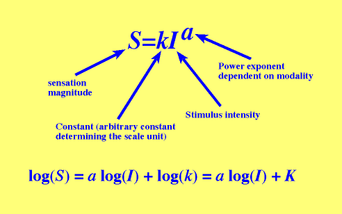

# 心理学

## 22 

**视觉与心理学**
没有视觉就没必要谈颜色，谈颜色就需要对颜色量化，而如何量化就需要参考人的视觉需求来分析

Weber's Law
韦伯定律

Fechner's Law
费希纳定律

[Steven's Power Law](https://www.cis.rit.edu/people/faculty/montag/vandplite/pages/chap_6/ch6p10.html)

斯蒂文斯 幂定律， 用数量估计法研究了刺激强度与感觉大小的关系

