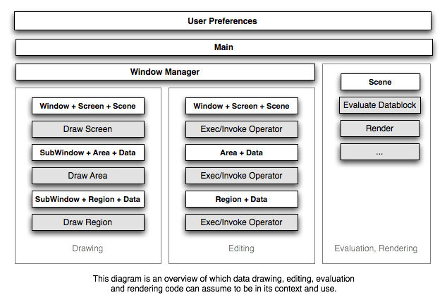

# Blender

由三种语言开发，data-api级别都是C，与各个其他模块的接口也是C-API居多，C++负责了一些需要高级抽象的概念，如跨平台的接口封装；python主要处理上层业务逻辑，且向外提供操作的服务。

**abbr-prefix**

blender的模块化很好，每个模块都有自己的缩写，理解缩写就很好理解模块本身代表的含义了。

- MEM=**Mem**ory Management,在`doc/guides/blender-guardedalloc.txt`描述了内存管理的使用规则，	Blender使用自己的一套函数，前缀为`MEM_`的系列函数。
- BLI=**B**lender **Li**brary,  they're generic functions that are used all over Blender. This BLI was originally coded by Daniel Dunbar (zr)
- BKE=**B**lender **Ke**rnel
- BIF=
- NLA=Non Linear Animation非线性动画
- UCS=User Cooordination System

**文档**

[当前版本文档](https://wiki.blender.org/wiki/Main_Page),
[已存档的文档](https://archive.blender.org/wiki/index.php/)

## 数据结构

### Two Way Linked Dynamic List

### Directed Acyclic Graph-DAG
DAGs are very often used for scheduling applications.

## Architecture
- [2.5 doc](https://archive.blender.org/wiki/index.php/Dev:2.5/Source/Architecture/Context/)

### RNA

### Context
 

### Operators

### Window Manager 

blender的MVC
2.5之前的模式是data-view-edit，没有中心注册机制处理事件，每个view都有自己的事件处理，
2.5之后，

- View是处理所有事件的唯一，就是wmWindowManager。
- Controller在blender中分成两部分，处理View的相关组件(event handler)，和Data相关的组件(operator),
	这样做的好处是重复利用
- Notifiers与Events的区别，
	- events是user input，timers，其他的events，需要处理的
	- notifier关注的是发送到interface，刷新或改变views，是内部模式，不需要draw的使用notifiers 

**blender的data api是针对blender的DNA和RNA的操作，但是部分模块并没有使用这些API接口，如bmesh和aud模块**

