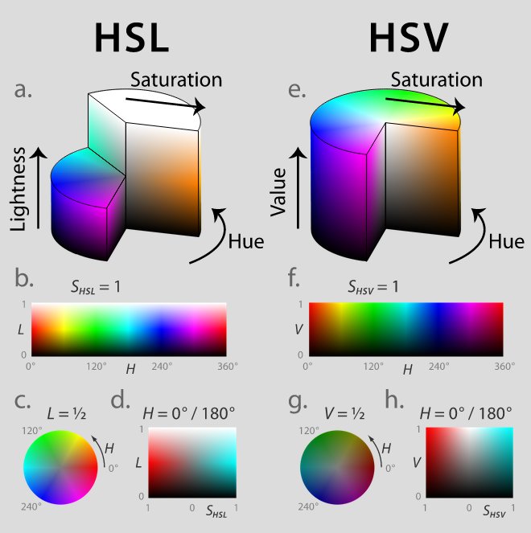

# Color

色彩主观就是光线给人眼的感觉，客观地说就是人眼对可见光0.43um到0.78um的波长，不同的波长对人眼产生不同的神经信号，传递大脑的感知就是色彩，非可见光人眼是无法感知的。

如果一束光，它的光子都是同一波长的，就是单色光；不同波长的光合在一起就是混合光；

## Color Model & Space

- Color Model色彩模型是指一个抽象的数学模型，用来描述一个颜色怎么样被表达成一组数字，通常会用3个或4个数值表示
- Color Space是色彩模型有了数值具体的表述和规则，所有色彩形成一个封闭集合，并有计算属性，这个集合就是色彩空间

- additive model，加性模型，根据三原色原理规定一个坐标轴分别代表RGB立体数学模型
- 减性模型，越混合越黑

- RGB，大多与显示设备、输入设备(数码相机、扫描仪)相关联的
    - sRGB，1996，较小色域空间，主要应用在网页浏览，在色彩调整及转换时会保存信息以备使用
    - AdobeRGB,1998，为解决sRGB不能覆盖CMYK的问题，为了显示器，主要在蓝绿色方向进行扩展，完全覆盖sRGB，基本覆盖CMYK
    - AppleRGB
    - ProPhotoRGB
    - ScRGB
- CMYK，C青M洋红Y黄，k是key color，因为实际CMY很难混合出纯粹的深灰色或黑色，加一个key，一般是黑色。主要用于印刷行业
- CIE, 国际照明委员会指定的一种色彩标准模式，它们都是从人眼原理经过实验得到的色彩空间，以数字化方式来描述人的视觉感知，与设备无关，弥补了RGB和CMYK模式必须依赖于设备色彩特性的不足
    - Lab，自然界中任何一点色都可以在Lab空间中表达出来
    - XYZ，
    - RGB，
- HSL/HSV(B)，色调(相)Hue，指物体传导或反射波长，通常取值范围是0到360度的数值衡量； 色饱和度Saturation或Chroma，指色彩的强度或纯度，是灰色与色调的比例，由0%灰色到100%完全饱和来衡量；L亮度Lightness/Luminance， V(B)明度Value(Brightness)， 指颜色的相对明暗度，通常以0%黑色到100%白色来衡量.
- YUV，最初是为了将Y(Luminance)亮度和UV色彩分开，为电视和媒体产生的。

AdobeRGB比sRGB有更广的色彩空间，包含了sRGB没有的CMYK色域，层次较丰富，但色彩饱和较低，摄影作品中精细调整色彩饱和度就是AdobeRGB

AdobeRGB转sRGB，色彩会有损失；sRGB转AdobeRGB，实际上并没有变换。

HSL/HSV解释：L是指从最暗的黑色到色相纯色再到白色，L最大时，不管H多少，都是白色；V是从黑色到标准色相，明度最大时就是纯色H，只有S最小时才是白色

## Gamma Correction

gamma校正，存在的原因有

- 远久的CRT显示器自带2.2的gamma
- 人眼对暗部细节更敏感，对亮度感知不均匀，0.2左右的反射率产生的灰被认为是中灰
- sRGB标准定义了2.2，也是显示器使用形式

应用中的难点

- gamma meta在不同应用中解释不一致，缺乏标准
- 与RGB应用时，需要转换，否则产生意外的结果

## 其他

把场景变成数字化的图片，需要光学信号进行采样sampling和数字化，sampling决定了图片的分辨率，即单位尺度内的单位像素的个数；数字化，在常见色彩空间下，用8bits，共256个阶梯来数字化

HDR高动态范围High dynamic range，就是添加更多的动态范围到图片中，人眼对场景采样是有能自动**变焦频率**的，即在明暗对比度比较强烈的场景下人眼都能看得各个部分的细节，但相机等在拍照时由于变焦固定或频率很低，得到的图片就只有一个焦距上的细节，导致细节上的缺失。通过多次曝光，得到不同亮度不同焦距内的细节组合起来提高清晰度，这就是HDR。

## 术语

- 亮度Lightness、Luminance
- 明度Brightness、Value
- 辉度Luma，把使用色觉校正的结果称为辉度

## JS

- [iro-core实现了颜色的转换核心](https://github.com/irojs/iro-core)
- [Okhsv and Okhsl -- Two new color spaces for color picking](https://bottosson.github.io/posts/colorpicker/)
- [Project Status, and iro.js 6.0](https://github.com/jaames/iro.js/issues/217#issuecomment-1214403290)
    - [Chroma.js is a tiny small-ish zero-dependency JavaScript library (13.5kB) for all kinds of color conversions and color scales.](https://github.com/gka/chroma.js/)
    - [Color conversion & manipulation library by the editors of the CSS Color specifications ](https://github.com/LeaVerou/color.js)
    - [A comprehensive color library for JavaScript.](https://github.com/Evercoder/culori)