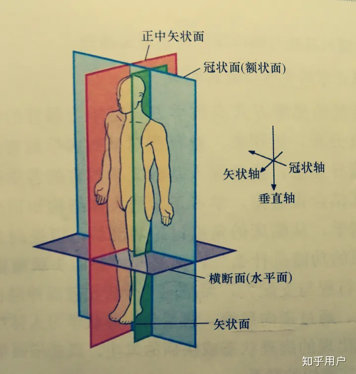

# CT

- [vtk-js doc](https://kitware.github.io/vtk-js/docs/)

## 解剖名词

- 冠状面coronal plane，前后，纵切，把人体分成前、后两部分
- 矢状面sagittal plane，sagittal来自拉丁文sagitta箭，对应中文就是矢，左右，侧切，把人体分成左、右两部分
- 水平面transverse plane，横切，把人体分成上、下两部分

## [DICOM--Digital Imaging and Communications in Medicine](https://www.dicomlibrary.com/)

### 概念

**Application Entity (AE)**，Application Entity 代表DICOM通信中的一个终端，可以代表一个系统或者一个程序。每个系统中的AE拥有一个唯一的Application Entity Title (AET) 。AET的要求时不能超过16个字节。一个设备上面可以有很多个AE。

**Association**，Association 是DICOM中定义的通信管道。在DICOM定义的通信协议中，提供服务的被称为 Service Class Provider (SCP), 消费服务的被称为 Service Class User (SCU)。这和我们HTTP中的server和client异曲同工。两个Application Entity如果想要通信，必须由一方发起一个Association，这个就是SCU，并且询问另一方（SCP）是否支持具体的功能。

**SOP**，SOP是 Service-Object Pair的简称，是Abstract Syntax的一种，一般来说两者概念可以互通。表示Application Entity提供的针对不同对象的相应能力，比如存储CT影像等。SCU可以申请具体的功能，而SCP在提供服务时也会申明自己能够提供的功能。

[**Transfer Syntax**](https://www.dicomlibrary.com/dicom/transfer-syntax/)，Transfer Syntax是一个或者多个Abstract Syntax的集合，同时额外定义了传输的DICOM文件的编码规则。

[**Modality**](https://www.dicomlibrary.com/dicom/modality/)，医疗影像有很多的分类，例如超声影像，CT等，对此DICOM协议中也留有字段进行标识，这个就是Modality，可以根据这个Tag来进行区分影像的类别。

[**Attribute**](https://dicom.nema.org/medical/dicom/current/output/chtml/part05/sect_6.2.html#table_6.2-1),extract DICOM metadata and organize patients/studies/series, 在DICOM中，第一要知道的就是这三个定义的含义，Study是DICOM中虚拟出来的一个定义，可以表示针对病人进行的一次检查。病人可以有多次检查。Study包含一个或多个Series，Series一般用来表示病人进行的某一部位的检查，一次完整的检查可能包含多个部位。Series包含一个或多个Instance, 一个Instance就是一个DICOM文件，指的是一次完整的扫描，可以是简单的扫描，便是单帧照片。也可以是长扫描，便是多帧照片。

- [DICOM Study Series](http://micropilot.tistory.com/m/2102)

### Part10格式
要求每个DICOM文件包含128字节的文件头和一个多多个数据元素组成的数据对象。

### web

- [dcmjs](https://github.com/dcmjs-org/dcmjs) or [daikon](https://github.com/rii-mango/Daikon) for parsing metadata
    - [dicom-parser](https://github.com/cornerstonejs/dicomParser)解析Part10格式的 
    - daikon不测试dcm文件
- itk.js readImageFile or readImageDICOMFileSeries to generate an itk.js Image
- process with runPipelineBrowser with IOTypes.Image
- convert the itk.js Image to an vtk.js ImageData
- visualize in vtk.js

WADO:Web Access to DICOM Objects

- [DICOM PS3.1 2023b - Introduction and Overview](https://dicom.nema.org/medical/dicom/current/output/html/part01.html)
- [dcm4che DICOM Toolkit & Library](https://github.com/dcm4che/dcm4che)
- [一个开源的系统](https://github.com/weiyangtang/dcm4cheSystem)
- [dicom标准中文版](https://github.com/weiyangtang/dcm4cheSystem/releases/tag/dicom%E6%A0%87%E5%87%86%E4%B8%AD%E6%96%87%E7%89%88)

- [DCMTK is a collection of libraries and applications implementing large parts the DICOM standard](https://dcmtk.org/dcmtk.php.en)
- [DCMTK github](https://github.com/DCMTK/dcmtk)

- [WADO Server 测试网站](https://www.dicomserver.co.uk//WADO/)

- [itk-document](https://docs.itk.org/en/latest/learn/faq.html#how-do-i-read-a-volume-from-a-dicom-series)
    - [itk-wasm document](https://wasm.itk.org/en/latest/typescript/distribution/vite.html)
- [医疗业务学习笔记--DICOM协议的基础内容](https://zhuanlan.zhihu.com/p/74966427)

## [NII](https://nifti.nimh.nih.gov/pub/dist/doc/ANALYZE75.pdf)

[NIFTI(神经影像学信息计划Neuroimaging Informatics Technology Initiative)](https://nifti.nimh.nih.gov/)是一种标准

一种更简单的数据格式，一个NIFTI格式包含三部分
- hdr
- ext
- img
