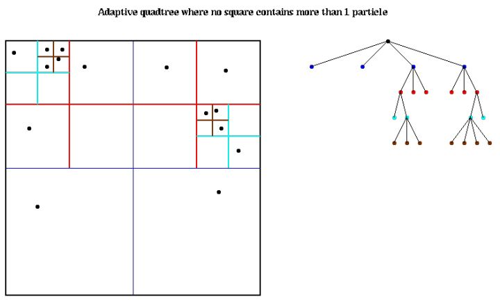
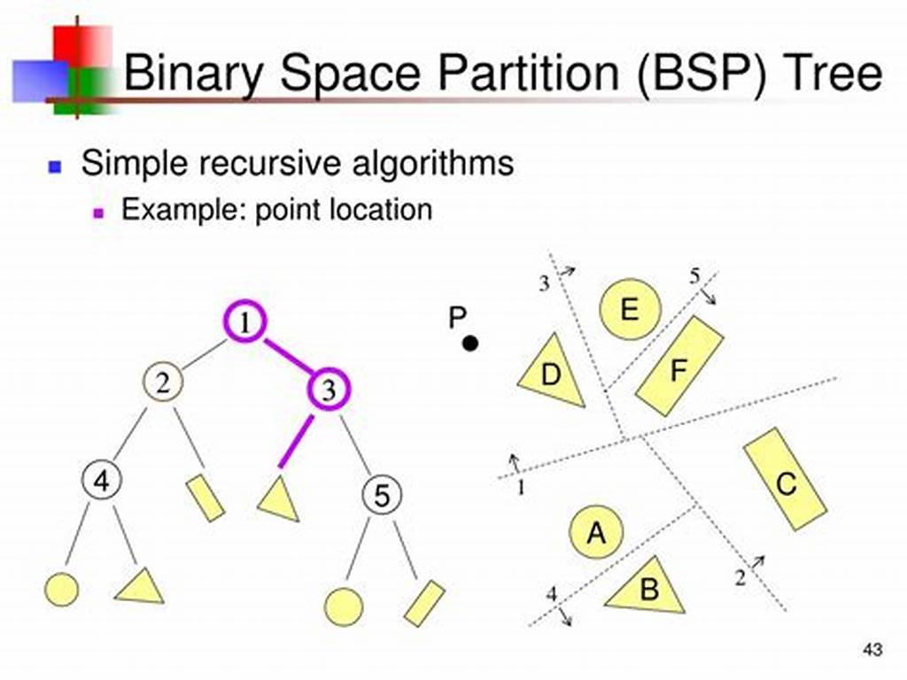
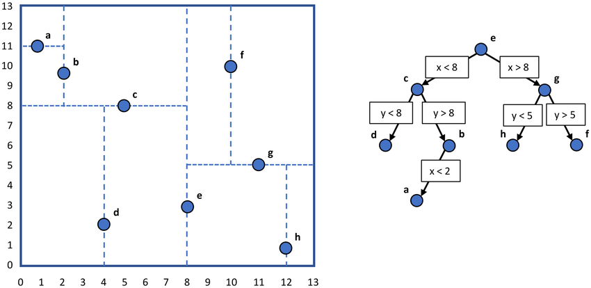
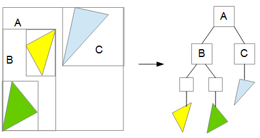

# Culling

在三维渲染引擎中，如果可渲染对象很多，当前视角下渲染对象较少时，会有一个culling过程，在渲染前剔除不必渲染的对象。

当前视角下，就是camera的视锥体frustum和可渲染对象进行相交测试，如果不相交，就属于不必渲染对象，如果相交，还需要做截断处理，只在frustum内部的才是符合当前视角下需要渲染的对象。

Culling算法的复杂度上限是O(n),即把每个可渲染对象逐一与frustum进行相交判断。当可渲染对象个数n很大时，可通过巧妙地设计数据结构来降低复杂度。frustum是当前视角下的一个窗口，它是空间性变化的，利用空间位置的关系就是必然地选择结果。

相交的判断方法很多，根据相交结果可分三类可渲染对象：

- 可渲染对象全部包含在视锥体内
- 可渲染对象全部不在视锥体内
- 可渲染对象部分在视锥体内

对部分在视锥体内的可渲染对象，继续分成若干子集，递归地处理这个culling过程，这样把时间复杂度降低为O(logN)。

## 空间管理

为方便描述，以2D为例，但所有算法很容易推广到3D空间。最简单和自然的方法就是等距网格把空间分成等大的距离，符合坐标系特征，数据结构简单，可以快速O(1)定位到子空间的位置。

缺点：空间很大，可渲染对象分布不均匀时，就像稀疏矩阵一样，成本非常大。

**空间划分仅仅是cache，而cache可根据实际需求去设计或重建规则的**

### Quad Tree
四叉树

解决等距网格的方案就是网格分级，先用粗狂的分割方案将空间粗略分隔，如果子空间中可渲染对象不多时，就不需要细分了，否则就递归分隔成更小的子空间。权衡实现的复杂度成本，四叉树就是一种可行方案。

从空间中心，沿着两个互相垂直的坐标轴，将空间分成四份；根据需要，将可渲染对象数量多的区域递归的分隔为四个子空间，将这个思路推广到3D空间，就是八叉树Octree。

上图就是四叉树，是对等距网格的改良，降低可渲染对象稀疏时子空间的管理成本，但缺点也较多：

- 对于无限空间，不太容易选取分隔点
- 通过空间位置定位子空间的复杂度从O(1)上升到O(logN)
- 对象是有体积的，如果对象超出等距的空间大小，对象的归属问题比较突出

### BSP

为解决上面四叉树的缺点，引入Binary Space Partition二叉空间分隔方案, 四叉树与八叉树都是对应了空间坐标的特点，自然地可以想到最简洁的应该是二叉树，每次对空间一分为二，然后根据需要递归对两个字空间进行分隔，最后的效果是一样的，但数据结构就更紧凑，算法实现更高效。

因为二叉树与坐标轴对齐，从空间原点开发分隔都可以不是必须条件，就是说可以用任意角度的直线在任意位置对空间一分为二，3D空间中是存在平面来分隔。如下图所示

用任意直线分隔，算法上涉及更复杂的数据运算，选择任意直线也是一个较复杂的情况。

### K-D Tree

为解决BSP的劣势，给定约束，保持分隔线和坐标轴对齐，切割点不从中心，而是选择恰当的地方，效果可能更好。

如上图所示，每次分隔子空间时，都选一个坐标轴平行线，让分隔后的阿左右子空间均衡的容纳相同数据的可渲染对象。这样处理后，每个子空间容纳的对象数量相当，可以看成是一个完整的二叉树，即每个叶子节点的深度一致。

完全二叉树不管是空间管理还是算法处理上都有很大的优势，存储一个n层的完全二叉树，只需要2^n-1个连续slot空间即可。定位子空间的复杂度又回到O(1)，因为节点的索引乘2后，就可以计算出左右字节的位置。

图中可以看到，分隔空间是以可渲染对象的中心点为参考的，但是对象是有体积的，与之前的对象归属问题有同样的困境，实际是在视锥体内，但有的子空间不在视锥体内，对象因为压线的缘故超出了子空间的范围。

### BVH

为了解决k-d2的问题，增加约束，只以对象中心点和分隔线去判定对象的归属，每个子空间都重新根据内部的对象的包围盒计算出一个整体的包围盒，即相邻一对子空间的包围盒很可能有重叠部分。

通过包围盒的计算，也解决了无限空间的分隔问题。这就是bounding volume hierarchy方案。下图是2D中的一个图示分隔结果。

## 剔除

上面说的与视锥体相交，因为模型的不规则，很难精准计算与视锥体的交集，为减少计算量，一般使用轴对齐包围盒AABB，有向包围盒OBB，或者包围球BSphere代替模型本身进行相交计算。

上面减少了计算量，如何加速计算了？就是利用CPU的**SSE指令集**，它执行方式为SIMD，即单指令多数据，可以同时处理多组浮点数的相同运算，这样可以同时处理多个包围盒与视锥体的相交测试，可参考Frostbite的文档

### Portal

portal的应用场景于封闭的室内空间，假设身处一个封闭的大房子里，房子里有很多相连的房间，portal就是类似于房间之间的门。把房间看作一个孤立的节点，那portal就是连接这些节点的桥梁，当在一个房间里(节点)时，只有那些与它相连的房间才有可能被我们看到，portal就是美术或策划在制作关卡过程中人工标记出来的连接。

剔除的过程就是只处理与当前portal相连的节点，其他都判定为不可见而被剔除。这样就节约了大量的计算量来判断是否剔除。

### Occlusion Query

视锥体内的模型因被其他模型完全遮挡，减少这类可渲染对象的渲染，会提高渲染性能。在occlusion query被支持后，GPU上执行遮挡剔除就是可行的了。允许在绘制指令执行之前，向GPU插入一条查询，并且在绘制结束后的某个时刻，从GPU将查询结果回读到系统内存中，这条查询指令得到的是某次DrawCall中通过Depth Test的Sample数量，当Sample的值大于0时，表示当前模型部分可见，否则就是完全被遮挡，可剔除避免渲染。

一个比较简单的遮挡剔除策略流程大致如下： 

- 用一个简单的depth only的pass绘制场景
- 每次绘制前后插入occlusion query的指令，并根据passed sample count去标记某个可渲染对象是否被完全遮挡
- 执行正常的渲染流程，并剔除那些完全被遮挡的对象。

对于复杂的场景，更适用的策略也使用包围盒代替模型本身去渲染；为了精确，可以用多个紧贴的包围盒或相对模型更简单的Proxy Mesh去做occlusion query；还可以使用batch多个模型或包围盒去减少occlusion query阶段的draw call数量。

缺点就是把结果回读到系统内存里，相当于强制在回读位置插入了一个CPU和GPU的同步点，很可能得不偿失。类似的问题有Render To Texture的Object Picking产生性能问题。为解决这个问题，使用下面的方法：

- 常见地方法是让CPU回读前一帧的occlusion query的结果，用来决定当前帧某个物体是否visible，UE4默认使用这种遮挡剔除方案
- 用一个类似于分支预测的思路，利用两帧图像的连续性假设，把整个渲染队列里的物体分成上一帧可见模型和上一帧不可见模型，具体的算法是hide stall。

### Software Rasterization

Frostbite用于BattleField3的剔除方案，首先利用CPU构造一个低分辨率的Z-Buffer，在Z-Buffer上绘制一些场景中较大的遮挡体(美术设定的一些大物体+地形)， 在构造好的Z-Buffer上绘制小物体的包围盒，执行类似于occlusion query的操作。

### GPU Driven Rendering Pipeline

硬件支持Computer Shader和ExecuteIndirect，前者允许在GPU上方便地执行各类和渲染无关的GPGPU运算，并将计算结果以Buffer或Texture的形式存储在VRAM上；后者允许以GPU Buffer形式直接构建Draw Command List。两者结合起来，就能够在Compute Shader里构造Draw Command List用于绘制，整个过程无CPU参与。

## 硬件层面的剔除

- Clipping&Backface Culling
- Early-Z
- Z-Cull

## 阴影剔除

shadow

## 扩展

culling是一个优化流程，有没有culling结果都不受影响，对场景中可渲染对象分组是核心，怎样分组是不同情况应付不同数量级的结果，很难有普适的最优方案。

引擎场景中管理着可渲染对象，基本都是以一个场景树实现的，场景树中的每个节点都维护着子节点的包围盒，或包围球之类的，或兼之多种。如three.js的webGL渲染引擎，浏览器本身就是一个场景树，再加上每个Object3D的Geometry都有bounding box和bounding sphere

从算法上剔除到硬件剔除是一个粒度逐渐变精细的过程

Mesh -> Cluster -> Triangel -> Pixel Tile -> Pixel Quad

现代硬件发展，除减少CPU和GPU的通信成本以为，可编程管线的功能日益强大是需要关注的；相对于密集的计算量，如何依赖现代硬件实现并行，减少等待与同步，优化访问逻辑都是需要关注的。

## 参考
- [裁剪和空间管理](https://blog.codingnow.com/2020/07/culling_space.html)
- [剔除，从软件到硬件](https://zhuanlan.zhihu.com/p/66407205)