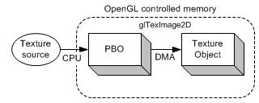
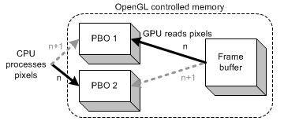

# OpenGL
> [The Wiki is a collection of information about OpenGL, as well as frequently asked questions about OpenGL and its API. ](https://www.khronos.org/opengl/wiki/Main_Page)

- [opengl 4.x](https://registry.khronos.org/OpenGL-Refpages/gl4/)

Context上下文是OpenGL的核心，因为OpenGL就是一个状态机，上下文中就保存了各种状态值，是所有执行指令的基础， 这个概念比较接近底层。统一的API是由显卡驱动提供的，负责沟通驱动与系统接口的是一些跨平台的库，如glew，glad，glad是更现代的库。

客户端与服务端也是OpenGL的一个很重要的概念，一般把应用层属于客户端，硬件与驱动程序看成服务端，它们各自维护着各自的状态，正是这个特性，使得OpenGL的接口非常精简，基本没有任何的数据结构在API层表现出来。

```c
glEnable();
glDisable();
glEnableClientState();
glDisableClientState();
```

glEnable/glDisable是Context中状态的激活/关闭

OpenGL指令就是API函数，是面向过程的函数，本质就是对Context的状态值的更新。切换Context的开销较大，但不同的绘制模块，可能需要完全独立的状态管理，因此在application中创建多个不同的上下文，在不同线程中使用不同的线程，上下文之间的共享纹理、缓冲区等资源是一种常规的优化方案。

webGL也是建立在OpenGL上的，在网页中使用多个Canvas比单独在一个canvas中操作有更好的性价比。

## Buffer

缓冲区是一个很泛的概念，很容易混肴，下面针对主要的进行说明一下

Buffer Object

### FBO

FBO(Frame Buffer Object)帧缓冲区对象，它并不是内存块，不实际存储数据，就像画画中的一个画板，画画时需要画布，在画布上才能进行绘制。帧缓冲区也需要画布附着Attachment在上面。FBO支持三种Attachment：

- Color颜色，存储区域称为ColorBuffer， 就是绘制的图像数据，即RGBA数据，如果使用了Multiple Render Targets技术，Color Attachment的数量可能有多个
- Depth深度，存储区域称为DepthBuffer，是绘制图像的深度数据，主要在3D渲染中使用，一般用于判断物体的远近来实现遮挡效果。
- Stencil模板，存储区域称为StencilBuffer，是渲染中较为高级的技术，就像印刷中的模板一样，一般用于渲染时进行像素级别的剔除和遮挡效果，如三维物体的描边。


上面说的Attachment的画布具体的就是纹理Texture和渲染缓冲区RenderBuffer，Texture和RenderBuffer都是存储图像的内存块。

- Texture是一个Offscreen离屏图像存储，因此会有多种格式，1D、2D、2DArray和3D纹理等，同时纹理还可以有其他的特性如minmap。
- RenderBuffer一般是OS提供的窗口内存块，屏幕的窗口都是2D平面图像。

一般来说，一张画布不能同时是两种类型的，即Texture与RenderBuffer不能同时挂载在同一个画板FBO上。

有了画布，就需要画画了，先描大致骨架再着色的画画流程与渲染图像类似，骨架(图元primitive)就是顶点数组VertexArray，是OS内存块存储的，VertexBuffer顶点缓冲区是GPU显存的内存。

与此概念雷同的是ElementArray索引数组和ElementBuffer索引缓冲区，存储的是顶点的索引，提高了复用顶点与数据量两个方面的优势。

上面说的是骨架，动笔绘画时就是绘制过程，针对没有索引提供了glDrawArrays绘制，有索引的提供了glDrawElements.

### VAO And VBO
> 这里只考虑有shader的流程，较老的api存在部分差异，[glBindVertexArray在3.1后才支持的](https://registry.khronos.org/OpenGL-Refpages/gl4/html/glBindVertexArray.xhtml)，流程上有些API的差异。因为随着GPU硬件的改进，只会越来越使用shader的了

VAO(Vertex Array Object)顶点数组对象，与FBO一样的概念，更像容器一样的感觉，它们都不是BufferObject，是为了管理数据而抽象成更高一层的概念，是一个状态容器。

```c
// 关联VAO，从CPU端可上传到GPU显存中
glBindVertexArray(VAO);
// 绑定VBO到VAO对象下
// 关闭VAO
glBindVertexArray(0);
```
VA(Vertex Array)，VA是client客户端的，是在CPU内存中，需要传输到服务端GPU显存中
VBO(Vertex Buffer Object)类型有
- GL_ARRAY_BUFFER顶点属性
- GL_ELEMENT_ARRAY_BUFFER 顶点索引
- GL_TEXTURE_BUFFER 纹理
- GL_PIXEL_UNPACK_BUFFER
- GL_PIXEL_PACK_BUFFER 像素数据，PBO(Pixel Buffer Object), 可通过DMA(Direct Memory Access)快速在显卡上传输

Context负责切换时，也只需要切换不同的VAO就可以了，数据都在VAO初始化完成，渲染只关联对应的VAO并获取对应的Buffer就可以渲染了，或者每个Mesh一个VAO也方便数据的管理。


FBO(Frame Buffer Object)

PBO,如下图所描述那样，它与像素数据的关系


使用和不使用PBO加载Texture




```c
glGenBuffers(2, pbos); // 创建两个pbo存储屏幕数据，一个内存和一个显存
glBindBuffer(GL_PIXEL_PACK_BUFFER, pbos[0]); // 绑定
glBufferData(GL_PIXEL_PACK_BUFFER, WIDTH * HEIGHT * 4, 0, GL_STREAM_READ); //分配显存
glBindBuffer(GL_PIXEL_PACK_BUFFER, pbos[1]);
glBufferData(GL_PIXEL_PACK_BUFFER, WIDTH * HEIGHT * 4, 0, GL_STREAM_READ); 
glBindBuffer(GL_PIXEL_PACK_BUFFER, 0); // 解绑

// DMA
glBindBuffer(GL_PIXEL_PACK_BUFFER, pbos[DMA]);
glReadPixels(0, 0, WIDTH, HEIGHT, GL_RGBA, GL_UNSIGNED_BYTE, 0); // 把屏幕数据读到绑定的pbo中

glBindBuffer(GL_PIXEL_PACK_BUFFER, pbos[read]);
void *data = glMapBuffer(GL_PIXEL_PACK_BUFFER, GL_READ_ONLY);
glUnmapBuffer(GL_PIXEL_PACK_BUFFER);
```

using PBO, OpenGL can perform asynchronous DMA transfer between a PBO and a texture object. 

Streaming texture uploads with 2 PBOs


```c 
// "index" is used to copy pixels from a PBO to a texture object
// "nextIndex" is used to update pixels in the other PBO
index = (index + 1) % 2;
nextIndex = (index + 1) % 2;

// bind the texture and PBO
glBindTexture(GL_TEXTURE_2D, textureId);
glBindBuffer(GL_PIXEL_UNPACK_BUFFER, pboIds[index]);

// copy pixels from PBO to texture object
// Use offset instead of ponter.
glTexSubImage2D(GL_TEXTURE_2D, 0, 0, 0, WIDTH, HEIGHT, GL_BGRA, GL_UNSIGNED_BYTE, 0);


// bind PBO to update texture source
glBindBuffer(GL_PIXEL_UNPACK_BUFFER, pboIds[nextIndex]);

// Note that glMapBuffer() causes sync issue.
// If GPU is working with this buffer, glMapBuffer() will wait(stall)
// until GPU to finish its job. To avoid waiting (idle), you can call
// first glBufferData() with NULL pointer before glMapBuffer().
// If you do that, the previous data in PBO will be discarded and
// glMapBuffer() returns a new allocated pointer immediately
// even if GPU is still working with the previous data.
glBufferData(GL_PIXEL_UNPACK_BUFFER, DATA_SIZE, 0, GL_STREAM_DRAW);

// map the buffer object into client's memory
GLubyte* ptr = (GLubyte*)glMapBuffer(GL_PIXEL_UNPACK_BUFFER, GL_WRITE_ONLY);
if(ptr)
{
    // update data directly on the mapped buffer
    updatePixels(ptr, DATA_SIZE);
    glUnmapBuffer(GL_PIXEL_UNPACK_BUFFER); // release the mapped buffer
}

// it is good idea to release PBOs with ID 0 after use.
// Once bound with 0, all pixel operations are back to normal ways.
glBindBuffer(GL_PIXEL_UNPACK_BUFFER, 0);
```

asynchronous glReadPixels() with 2 PBOs



```c 
// "index" is used to read pixels from framebuffer to a PBO
// "nextIndex" is used to update pixels in the other PBO
index = (index + 1) % 2;
nextIndex = (index + 1) % 2;

// set the target framebuffer to read
glReadBuffer(GL_FRONT);

// read pixels from framebuffer to PBO
// glReadPixels() should return immediately.
glBindBuffer(GL_PIXEL_PACK_BUFFER, pboIds[index]);
glReadPixels(0, 0, WIDTH, HEIGHT, GL_BGRA, GL_UNSIGNED_BYTE, 0);

// map the PBO to process its data by CPU
glBindBuffer(GL_PIXEL_PACK_BUFFER, pboIds[nextIndex]);
GLubyte* ptr = (GLubyte*)glMapBuffer(GL_PIXEL_PACK_BUFFER, GL_READ_ONLY);
if(ptr)
{
    processPixels(ptr, ...);
    glUnmapBuffer(GL_PIXEL_PACK_BUFFER);
}

// back to conventional pixel operation
glBindBuffer(GL_PIXEL_PACK_BUFFER, 0);
```

## 接口

### [glDrawBuffers](https://registry.khronos.org/OpenGL-Refpages/gl4/html/glDrawBuffers.xhtml)

define an array of buffers into which outputs from the fragment shader data will be written, shader输出到缓存中。它需要绑定Framebuffer Object，如果是0，就是默认的framebuffer绑定。

```c
GLuint attachments[] = { GL_COLOR_ATTACHMENT0, GL_COLOR_ATTACHMENT1 };
glDrawBuffers(config.num_color_buffers, attachments);
```


## UI库

- [NanoGUI is a a minimalistic cross-platform widget library for OpenGL 3.x. It supports automatic layout generation, stateful C++11 lambdas callbacks, a variety of useful widget types and Retina-capable rendering on Apple devices thanks to NanoVG by Mikko Mononen. Python bindings of all functionality are provided using pybind11. ](https://github.com/wjakob/nanogui)

- [RmlUi - The HTML/CSS User Interface library evolved ](https://github.com/mikke89/RmlUi)

## oglplus

- [OGLplus's Documentation!](https://matus-chochlik.github.io/oglplu2/sphinx/index.html)
- [github](https://github.com/matus-chochlik/oglplus)

## tools

### [glad](https://glad.dav1d.de/)

- [Vulkan/GL/GLES/EGL/GLX/WGL Loader-Generator based on the official specifications for multiple languages.](https://github.com/Dav1dde/glad)
- [This is a webservice for glad, a multi-language Vulkan/GL/GLES/EGL/GLX/WGL loader-generator based on the official specifications.](https://github.com/Dav1dde/glad-web)

初始化时，一定注意顺序，特别是封装成框架时，一定要注意这个顺序，否则调用任何gl的函数都会失败
```js
void initOpenGl() {
    // 必须先执行
    glewInit();
    // glad的执行前提窗体的上下文context中，即需要先创建窗体
    this->window = glfwCreateWindow(resolution.width, resolution.height, "OpenGL", NULL, NULL);
    if (!this->window) {
        glfwTerminate();
        throw std::runtime_error("Failed to create GLFW window!");
    }
    glfwMakeContextCurrent(this->window);
    // 执行任何gl函数前，需要初始化glad
    if (!gladLoadGLLoader((GLADloadproc)glfwGetProcAddress)) {
        std::cout << "Failed to initialize GLAD" << std::endl;
    }
}
```


## 参考

- [OpenGL基础，一个韩国人写的基础知识](http://www.songho.ca/opengl/index.html)
- [OpenGL教程和资料集合](https://zhuanlan.zhihu.com/p/41818595)
- [OpenGL Loading Library](https://www.khronos.org/opengl/wiki/OpenGL_Loading_Library)
- [GLRF - OpenGL Realtime Framework](https://github.com/DunkleMango/GLRF)
- [g-truc creation， OpenGL Mathematics (GLM) OpenGL Image (GLI)等有关opengl的文档与知识](https://www.g-truc.net/)

