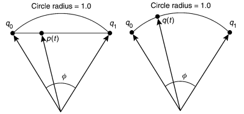

# Quaternion

四元数相比其他形式的优点：

- 解决万向死锁 Gimbal Lock
- 仅需存储4个浮点数，相比矩阵更轻量

现在主流游戏或动画引擎都会以缩放向量+旋转四元数+平移向量的形式进行存储角色的运动数据。

## 概念

从复数complex number扩展 到四元数的思路。

### 空间中的子空间

空间(维度>2)存在更低维的子空间，如二维空间中存在一维空间(直线)，三维空间存在一维空间和二维空间(面).超过三维后很难想象是什么样子，使用一个前缀超hyper来形容这些空间，如高维空间中的平面称为超平面hyper-plane。

### 空间和子空间的映射

二维可表示(x,y)，y=0时，可以看成是一维的，形式是(x,0)，推广到四维(x,y,z,w)，当w=0时，(x,y,z,0)是一个三维子空间。在四维中对三维子空间进行旋转，最终的结果还是三维子空间。

### 广义球

在二维上，广义球就是circle；三维空间的广义球是我们认知上的球，称为two-sphere;四维空间中的广义球是一个超球hyper-sphere，又称three-sphere. 单位向量其实是广义球上的点，而单位四元数是three-sphere上的点。

### 约束与特征向量

空间中的一点用参数表示时与维数相等，二维用{x,y}表示，三维用{x,y,z}表示，但对空间点进行约束，则可以减少参数的数量，比如三维空间的点在某一单位球面上，可以用两个参数{u,v}表示。如果{u,v}是单位向量，可称{u,v}是{x,y,z}的特征向量。

这个概念解释是一个很新颖的思路，可推理为四元数的很多特性是从低维拓展的结果，具体地说就是从复数概念拓展的。复数的提出将原本一维的数值范围直接增加了一个维度，数据量的增幅就是巨大的。从客观上，三元数、四元数、n元数都是存在的，即复数的无穷个等级，但并不是所有数系都满足模运算，且随着维度的提高，特性会逐步牺牲，相比复数运算，四元数牺牲了交换律；相比四元数，八元数牺牲了结合律，目前四元数的应用最广泛。

## 理解

- 四元数(单元四元数)是四维空间中一个超球面上的点，满足w^2+x^2+y^2+z^2=1.纯四元数是四维空间在w=0时的一个子空间的点，形式为{0,q}。**纯四元数与四元数是不同的概念**
- 四元数是复数虚部扩展的结果，复数虚部为一个，而四元数虚部有三个，且两两互相正交
- 四元数自由度并没有四个维度，由于w^2+x^2+y^2+z^2=1约束，它的自由度只有三个，且每个四元数可以对应一个特征向量，即n。**四元数并不是与特征向量一一对应的**

四元数存在于四维空间，利用低维信息去理解高维信息就需要另辟蹊径来理解，还是以三维的球来举例，球这种特殊的情况来分析也是满足前面说的约束条件，《Visualizing Quaternions》的第八章Visualizing Spheres描述得比较清晰。

## 应用

四元数有关的推理有多种形式，一是从代数上硬计算，一种是从四元数本身的性质上进行推理，形式不同结果都是相同的。

目前底层图形API，基于空间坐标的转换还是矩阵形式，四元数的旋转应用到物体上，还是要以矩阵形式， 四元数的矩阵形式是一个重要的接口。

旋转的插值，从动画应用角度来解释，为保证每帧的旋转都是均匀变化的，弧线的线性插值会改变长度，四元数的线性插值得到的不一定是单位四元数，而四元数的球面插值Slerp就不会破坏长度不一致。主体思想就是施密特正交

### 万向节死锁

万向节死锁早期是用来处理机械臂在旋转时自由度缺失的问题，由于当时机械臂的关节都是单自由度的，在模拟人体某些球形关节(自由度为3的关节)的时候，会采用三组互相正交的机械关节进行模拟。当早期计算机动画把机器人那套搬过来时，使用欧拉角直接模拟旋转。

为避免这个问题，图形学旋转使用轴角，轴角可以将三个欧拉角等效成一个绕着特定轴旋转的角度，OpenGL早期的APIglRotate就是使用轴角的，轴角依然会产生万向节死锁，不过产生条件更难。

### 四元数插值

SLERP代表**S**pherical **L**inear Int**erp**olation

### 顺序无关的旋转混合

骨骼动画会混合多个Pose，假如Pose中每个节点的姿态都用一个包含位移、旋转、缩放的Transform表示，如何混合Transform呢？用四元数表示的旋转如何混合呢？

旋转构成的空间非线性，无法对旋转操作直接进行线性叠加，且旋转操作具有不可交换性。

如果精度要求不高，可以扩展两个四元数的NLerp(Normalized Lerp)操作，对多个四元数进行线性叠加后Normalize一下，效果还可以，算是一个trick。

四元数相乘是两个旋转叠加，可不满足交换律，多个就更不行，用球面Slerp需要满足角速度匀速的球面插值没法扩展到多个四元数的情况， 上面的问题都牵扯进一个顺序的问题，需要一种顺序无关的混合方式。

旋转与朝向都可以用四元数表示，但是他们本质是不同的概念，就像位置与位移的差别一样，下面的方法只适用于旋转的混合，对应到Pose Blending，是Additive Blending，是变化量(位移，旋转)而不是位置量(位置，朝向)。

**单元四元数也是重点，很多特征才能应用上**， 单元四元数具有的性质：
- 对数操作相当于生成了一个实数部为0，虚数部是旋转轴按照角度进行缩放的一个向量
- 对数操作后的结果进行指数操作，可以恢复之前的值
- 幂操作相当于把四元数的旋转缩放了一个倍数

假设有两个旋转p1和p2，既然直接组合(相乘)有顺序问题，把每个旋转分成两份，这样不管p1在前还是p2在前，交替地顺序相乘后得到的公式的中间部分相同的；利用极限思维，切割成无穷份，中间相同部分会越来越多，这样就剩下两端不同，又因为分隔无穷份，两端的结果影响就非常小了，这样就得到一个稳定的结果。

上面的极限形式没法直接使用，单有公式Lie product formula(该公式是用于矩阵(方阵)的)，
经过推理后，上面极限公式等价于把四元数取对数后再相加，最后把结果进行指数运算。这里重点是可以进行加法运算了，而加法运算是可交换的，这样计算就是一个常量计算过程了。

关于这个理论，2002的siggraph有Linear Combination of Transformations论文，它针对是比旋转更高一层的变换，用矩阵表示的transform，思路类似，这里使用的是四元数。

## 参考

- [AxisAngle to Quaternion](http://www.euclideanspace.com/maths/geometry/rotations/conversions/angleToQuaternion/index.htm)
- [slerp](http://www.euclideanspace.com/maths/algebra/realNormedAlgebra/quaternions/slerp/)
- [Quaterion & Rotation](https://zhuanlan.zhihu.com/p/78987582)
- [Quaterion orderless](https://zhuanlan.zhihu.com/p/28330428?refer=HomoLuden)
- Visualizing Quaternions, 2005
- [Understanding quaternions](https://www.3dgep.com/understanding-quaternions/)
- [Understanding quaternions中文翻译](https://www.qiujiawei.com/understanding-quaternions/)
- Quaternions for Computer Graphics, 2011
- [Quaterions, Interpolation and Animation](http://web.mit.edu/2.998/www/QuaternionReport1.pdf)
- [Linear Combination of Transformations](http://mesh.brown.edu/DGP/pdfs/Alexa-sg2002.pdf)