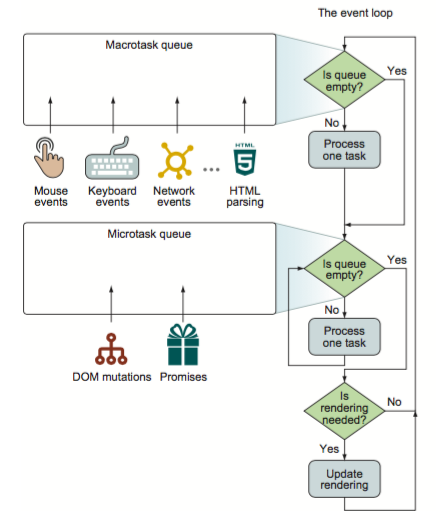

# ECMAScript

- [Standard ECMA-262 6th Edition / June 2015 ECMAScript® 2015 Language  Specification ](https://262.ecma-international.org/6.0/)
- [RxMarbles](https://rxmarbles.com/)
    - [github](https://github.com/staltz/rxmarbles)

## JavaScript

[JavaScripture The bridge between W3C, WHATWG and ECMAScript](https://www.javascripture.com/)

ECMAScript

Blob-binary large object

### [The Global Object](https://tc39.es/ecma262/multipage/global-object.html#sec-global-object)

globalThis对象可以访问全局的, 比如一个通用的库编译成es，umd等format时，umd的方法可以在古老的地方使用，如jsp中

### double exclamatioin mark

```javascript
bool = !!1; // bool true
bool = !!0; // bool is false
```
### double tilde

tilde的算法是

```javascript
~N=-(N+1);
~~N=-(-(N+1)+1)=N;
!~-1 = !-0 = !0= true;
if (!~arr.indexOf()) { // indexOf函数返回值-1
    // didn't find 
} else {
    // find it
}
```
在ES6中
```javascript
// ~~ is equal Math.trunc
~~"9";// 9
Math.trunc("9"); // 9
```

### format

```javascript
let v = 'str';
let str = `${str}--`
```

### optional Chaining
```javascript
a?.b  		// optional static property access
a == null ? undefined : a.b;
a?.[b]		// optional dynamic property access
a == null ? undefined : a[x];
a?.b()		// option function or method call
a == null ? undefined : a.b();
a?.()
a == null ? undefined : a();
```

***

### 特性

**this**

任何一段代码都是有上下文的，解释这段代码就是在一个上下文中，而上下文对象是通过this变量来体现的，即this永远指向当前代码所处的对象中。与静态OOP相比，静态OOP中的this就是对象本身，而Javascript中this是上下文，有可能不是对象本身。

**Data Types**

> 一个数据对象是mutable还是immutable是非常重要的，涉及到内存的管理和数据的重复使用的问题，语义不清晰时会造成不可查的BUG存在. 对于函数式的编程就是不需要程序员去管理内存，而是让编程语言具有内在的默认属性去支持高级语言的抽象化。
>
> > 与C，C++中的变量的副作用相关的概念

- Primitive，所有primitive都是不可变的值，它们是：Boolean, Null, Undefined, Number, String, Symbol
- Object，对象中的Data Property是一个可配置的基本属性，如有 Writable, Enumerable, Configurable等
- Function，函数构造器，返回一个函数对象，默认有个隐式参数数组arguments。还有一种更简单的形式**Arrow functions**:箭头函数比函数表达式更简洁,且没有自己的this,arguments,super或new.target. 用于匿名函数,如果C++中lambda函数用于匿名函数一样.
    - apply与call， 每个函数都包含两个非继承的方法。功能相同，用法存在差异
        - apply: 接收两个参数，一个是函数运行的作用域(this)，另一个是参数数组， xxFunc.apply(this,arguments)
        - call:区别在于参数必须详细列举出来
        
        ```javascript
        //Function.prototype.call;
        //Function.prototype.apply;
        this.foo(arg1,arg2,arg3) 
            = foo.apply(this,arguments) 
            = foo.call(this, arg1, arg2, arg3)
        // 模拟call的实现逻辑
        Function.prototype.call2 = function(context) {
            if (typeof context === 'object') {
                context = context || window;
            } else {
                context = Object.create(null);
            }
            var fn = +new Date() + '' + Math.random();
            context[fn] = this;
            var args = [];
            for (var i=1; i<arguments.length; i++) {
                args.push('arguments['+ i +']');
            }
            var result = eval('context[fn]('+ args +')');
            delete context[fn];
            return result;
        }
        ``` 
        它们真正的用处是能够扩充函数赖以运行的作用域
    - bind -- ES5，与apply和call相比，bind后不理解执行，而是返回函数对象
    ```javascript
    setInterval(function(){
        // do something    
    }.bind(this), 2000);
    ```
    这是this对象中延迟2秒执行。这里this是不确定的，是需要上下文来确定谁调用
    - 柯里化，是函数编程中十分重要的概念，如Haskell中的函数都是默认柯里化的。[curring](./js/currying.js)中例子展示了部分

- Promise

- Module, Module是解决了大型项目和模块化开发的基础, 在ES6之前,社区存在两种方案,一种是CommonJS适用于服务器端,一种是AMD,适用于浏览器端, 但是都是运行前加载的语法糖, ES6加入的Module改进了,使之可以在编译期进行额外的处理,如添加宏的语法功能,或类型检测, 从软件工程角度来看有如下几个角度：代码复用;功能代码松耦合;解决命名冲突;.代码可维护性;代码可阅读性.
    - IIFE立即执行表达式
    - 在JQuery时代,模块模式大量使用,痛点是严格限制加载的顺序
    `var utils = (function ($) {
        var $body = $("body"); 
        var _private = 0;
        var foo = function() {}
        return { foo: foo }
    })(jQuery);`
    - commJS,规定每个模块内部，module代表当前模块，这个模块是一个对象，有id,filename,loaded,parent,children,exports等属性，module.exports属性表示当前模块对外输出的接口, 特性有:
        - 加载模块是同步的，
        - 加载的是输出值的拷贝，即导入后的值不随原来值变化
        - 是为NodeJS而建的一个标准
        - 缓存已加载模块
- UMD(Universal Module Definition),UMD规范的JS文件就是一个立即执行函数，通过检测JS环境判断是那种模块定义
- ES6语言层面的模块化，编译时加载或静态加载，编译时就能确定模块依赖关系，输入和输出变量。特性：
    - 加载时是引用，即原始值变了加载的值也跟着变化
    - 动态加载，不需要缓存
- Prototype的使用
```javascript
function Base() {
}
Base.prototype = Object.assign(Object.create({}), {
	constructor: Base, 
	mem1: function() {
	}
});
function Drivered() {
}
Drivered.prototype = Object.assign(Object.create(Base.prototype), {
	constructor: Drivered,
	mem2: function() {
	}
})
```


### Event

浏览器中实现事件循环有两个概念：MacroTask宏任务和MicroTask微任务
macrotasks：setTimeout, setInterval, setImmediate, I/O, UI rendering
microtasks: process.nextTick, Promise, MutationObserver(HTML5)



[task demo](./js/task.js)

JavaScript代码执行顺序：从script开始，全局上下文进入函数调用栈，决定了执行顺序，直到执行完调用栈中非全局函数，然后执行microTask，执行完microTask后再次从队列中取一个macroTask执行，如此循环下去。

宏任务与微任务的最大区别是放置在不同的任务调度队列中， microTask调用优先级高于macroTask
在HTML5标准中Microtask queuing 称为微任务
在ECMAScript标准中的Executable Code and Execution Context中，称为Jobs and Job Queue

### MutationObserver

a interface provides the ability to watch for changes being made to the DOM tree.

### web worker
HTML5提供了一个javascript多线程解决方案，在之前DOM渲染与JavaScript执行是在同一线程中执行的，现在UI界面与web worker属于不同线程了。
- 通过worker=new Worker(url)加载一个js文件
- 通过postMessage(data)方法来向主线程发送数据
- 绑定worker.onmessage接受worker数据
- 使用worker。terminate()终止一个worker


### 工程化

Fetch API

```javascript
// 这里遇到一个阿里云url文件下载的问题，其实类似的地方都可以使用这个来下载
fetch(url)
.then((res) => res.blob()) // 这里res是Body对象
.then((data) => {
	// blob data
    const blob = new Blob([data],{type:'appliaction/octet-stream'});
    const a = document.createElement('a');
    const href = window.URL.createObjectURL(blob);
    a.href = href;
    a.download = 'filename';
    a.click();
    window.URL.revokeObjectURL(href);
})
```


### Source Map

js源文件转为生产文件后,调试非常麻烦,而对应的source map文件就是为了保留这个对应的文件,编译通过错误中的行列号定位错误的位置, 目前就chrome支持,Google的Closure编译器提供了支持生成map文件

### Dynamic Type

Variables in JavaScript are not directly associated with any particular value type, and any variable can be assigned (and re-assigned) values of all types

### 错误处理

Error， DOMException

try...catch...不能捕获异步操作

### 迭代

迭代器具有迭代的能力， 可以扩展接口
使用场景
```js
// 1, 解构赋值 
const [first, second] = range;
// 2, 扩展运算符
const arr = [...range];
// 3, 集合操作
const sume = Array.from(range).reduce((acc,num)=>acc+num,0);
// 实现方法
// 1，为对象添加Symbol.iterator方法来获取迭代器对象
const arr1 = [1,2];
const iterator = arr1[Symbol.iterator]();
console.log(iterator.next()); // {value:1,done:false}
console.log(iterator.next()); // {value:2,done:false}
console.log(iterator.next()); // {value:undefined,done:true}
// 
const range = {
    from: 1,
    to: 5,
    // 
    [Symbol.iterator]() {
        let cur = this.from, last = this.to;
        return {
            next() {
                if (cur < last) return {value:cur++, done:false};
                else return {done:true}
            }
        }
    }
    // 
    *[Symbol.iterator]() {
        for (let i = this.from; i<=this.to;i++) {
            yield i;
        }
    }
}
```

- 

## typescript
> javascript的超集，更加面向对象的编程语言，可以便宜为纯Javascript

```shell
tsc --init 自动生成tsconfig.json文件
```

### 特性

union
```typescript
type1 | type2 | type3
```
interface
Typescript的interface比起C#或Java来说时有区别的，Typescript更加广泛，
```typescript
interface SomePoint {
	x: number; 
	y: number;
}
interface SomePoint {
	z: number;
}
```
接口合并后增加了扩展性

class

标准模式
```typescript
class A {
	static st:string;
	inst: number;
	constructor(m: any){}
}
```
分解模式

```typescript
interface A_Static {
	new(m: any): A_Instance;
	st: string;
}
interface A_Instance {
	inst: number;
}
declare var A: A_Static;
```
内心时讨厌这种语法的，就是所学其他语言那样，变着花样让我去理解，很容易让人找不到头脑的，但是有时候又特别有用。

***

### [Declaration Files](https://www.typescriptlang.org/docs/handbook/declaration-files/introduction.html)

用来定义类型信息及接口规范，当使用扩展的JS库或插件API时，需要使用声明文件来描述库的类型。比如编辑器需要给引用库的提示，就需要类型信息与接口。所以早期的Javascript 库时没有类型定义信息的，需要创建一个对应的d.ts文件，如three-js这样的库。

写*.d.ts的流程，尽量从文档入口，不要被细节影像。

### 参考

- [typescript官网文档](https://www.typescriptlang.org/docs)

## QuickJS
> 是一个轻量，嵌入式的Javascript引擎

# Babel
babel7舍弃了以前的 babel-*-* 的命名方式，改成了@babel/*-*
处理流程


