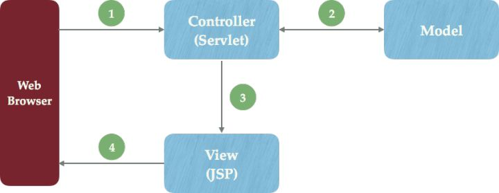

# JavaWeb

三大组件

- Servlet
- Filter
- Listener

## Servlet

Server Applet组成的词Servlet

处理客户端请求的动态资源，当在浏览器地址栏中按下回车后，请求会被发送到对应的Servlet上进行处理。

### 接收请求

客户端请求会被封装成HttpServletRequest对象，里面包含了请求头，参数等数据

### 处理请求

在service，doPost或doGet方法进行接收参数，然后调用业务层service进行处理

### 完成响应

处理完成后，会转发forward或重定向redirect到指定页面

#### forward

HttpServletRequest

#### redirect

HttpServletResponse


### JSP

java server pages, 是一种文本处理程序，就是HTML和Java代码在一个文件，与php与HTML一样。

JSP是Servlet对HTML的改进。JSP本身也是一种Servlet，JSP会在第一次被编译为HttpJspPage，它的父类是HttpServlet。

JSP比Servlet更好用的另一个重要性是，它内置了9个对象：out、session、response、request、config、page、application、pageContext、exception。

#### MVC
JSP是view层



## Filter

主要负责拦截请求和放行,分四大类
- REQUEST, 直接访问目前资源时执行的过滤器
- FORWARD,转发访问 执行过滤器
- INCLUDE, 访问执行过滤器
- ERROR,当目标资源在web.xml中配置为`<error-page>`中时的异常

url-mapping规则

- 精确匹配，/foo.htm
- 路径匹配，/foo/*
- 后缀匹配，*.htm
- 其他写法

filter执行的顺序决定于web.xml中的filter-mapping的顺序，前面的先执行，后面的后执行。
在这里使用static lambda声明了函数的原型
```java 
public class SystemFilter implements javax.servlet.Filter {
	@Override
    public void doFilter(ServletRequest servletRequest, ServletResponse servletResponse, FilterChain filterChain){
	}
}
```
在这里调用覆盖了lambda的默认空函数
```java 
public class LoginValidator implements org.springframework.beans.factory.InitializingBean {
	@Override
    public void afterPropertiesSet() throws Exception {
	}
}
```
目前这样的处理方法，不能避免DOS请求攻击服务器

## Listener

监听器，监听对象为

- Application
- Session
- Request

一旦这些对象发送变化，其监听器就会执行


