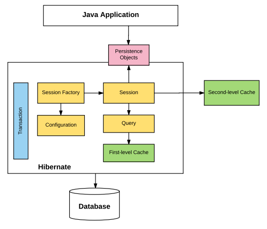

# JPA

## 配置

### Open Session In View 

OSIV,是为了解决mvc的controller中hibernate的lazy load的属性时没有session抛出的LazyInitializationException
，对hibernate来说，toMany关系是默认延迟加载，toOne默认是立即加载

```shell
spring.jpa.open-in-view=false
``` 

## Hibernate


JPA是标准接口，是一套规范；Hibernate是实现的一种方式，是框架


Hibernate主要通过三个组件来实现的

- hibernate-annotation 是Hibernate支持annotation方式的配置的基础
- hibernate-core 是核心实现
- hibernate-entitymanager 实现了标准的JPA，是hibernate-core与JPA的适配器

