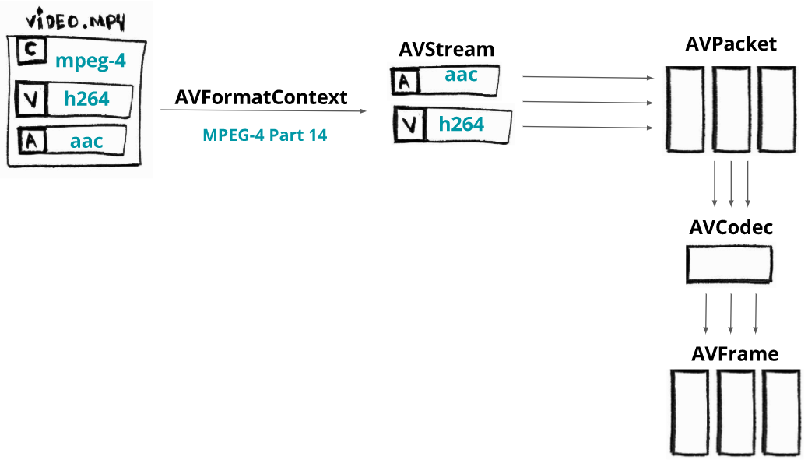

# FFmpeg

## 概念

### Muxing/Demuxing

IO Muxing/Demuxing library， Mux是multiplex的缩写，是多路传输
Muxing就是动词，混流，将视频流，音频流，字幕流混合到一个文件中
Demuxing是分离解析，从一个文件中分离音频或视频

合成器Synthesizer
所谓的“合成”把音频，视频流等用一个容器文件Contaienr封装起来，播放时先调用分离器Splitter分别获取
需要解码的流数据。
滤镜Filter实际就是指各种分离器或解码器(视频解码器和音频解码器)的统称

### Codec

执行编码的软件叫做编码器Coder或Encoder
执行解码的软件叫做解码器Decoder
编码器与解码器合称为编解码器Codec

### lib

ffmpeg是依赖file system，而libavXXX是通用的库，可以在内存中进行处理

- avutil， 工具库，包括安全的字符串函数，随机数等
- avcodec， 一个通用的编解码框架，包含了多种用于音频流，视频流，字幕流等编解码器，
和比特流过滤器filter
- avformat， 一个通用多路复用multiplexing/muxing与反多路复用demultiplexing/demuxing框架，
包含多种复用器muxer和解复用器demuxer
- avdevice，一个通用框架库，从多媒体设备上抓取流媒体，或渲染至多媒体
- avfilter，通用filtering库
- swscale，提供高度优化的图像缩放，颜色空间与像素格式
- swresample，音频重采样

### 解码流程



- AVFormatContext  容器，默认使用avformat_alloc_context()初始化
- AVIOContext 字节流，默认使用avio_alloc_context()初始化
- AVStream 流
- AVPacket 包 
- AVCodec 编码，压缩过程 
- AVFrame 帧数据，未压缩的数据， 必须使用av_frame_alloc()和av_frame_free()来管理，具体的数据还需
额外的操作

## 命令行

### images2video

```cmd
ffmpeg.exe -r 60 -f image2 -s 1420x944 -i test/%07d.png -vcodec libx264 -crf 25 -pix_fmt yuv420p test2.mp4

-r 帧率，每秒读取图片的数量
-f 
-s 分辨率
-i 
-crf 
-pix_fmt 
```

## Java

### JavaCPP Presents FFmpeg

JavaCPP是一个开源库，提供了Java高效访问本地C++的方法，采用JNI技术实现，支持所有Java

为调用本地的方法，JavaCPP生成对应的JNI代码，且把这些代码输入到C++编译器，用来构建本地库，
使用Java的Annotations特性在运行时自动调用Loader.load()方法从Java资源中直接获取。


### Xuggle

Java封装的FFmpeg库， 目前代码已经deprecated啦！

- 要使用前端获取图片在后台生成视频再返回给前端的逻辑

#### Xuggle概念

通过IMediaWriter完成由图片生成视频文件的逻辑

```java

final int MIN_BITRATE = 2000000;
final double BPP = 1;

int bitRate = (int)Math.max(w * h * fps * BPP,  MIN_BITRATE);
IRational frameRate = IRational.make(fps, 1);
deltat = 1e6 / frameRate.getDouble();
		
IMediaWriter mediaWriter = ToolFactory.makeWriter(path);
mediaWriter.addVideoStream(0, 0, ICodec.ID.CODEC_ID_MPEG4, w, h);

IPixelFormat.Type pixFmt = IPixelFormat.Type.YUV420P;
IConverter converter = ConverterFactory.createConverter(ConverterFactory.XUGGLER_BGR_24, pixFmt, w, h);

IContainer container = mediaWriter.getContainer();
IStreamCoder coder = container.getStream(0).getStreamCoder();
coder.setBitRate(bitRate);
// ....
IMetaData meta = container.getMetaData();
meta.setValue("title", "meijie-video");
// ....

IVideoPicture frame = this.converter.toPicture(image, (long)(this.frameNo * this.deltat));
frame.setQuality(0);
mediaWriter.encodeVideo(0, frame);

```

[1] https://www.ibm.com/developerworks/cn/java/j-lo-cpp/
[2] https://protogalaxy.me/ffmpeg%e4%b8%8e%e5%85%b6javacpp%e5%ae%9e%e7%8e%b0%e8%b8%a9%e5%9d%91%e7%ba%aa%e5%bd%95/
[3] https://github.com/leandromoreira/ffmpeg-libav-tutorial