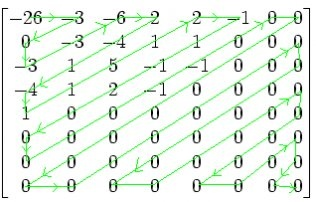

# images

## JPEG
是一种有损压缩,损失的部分是人眼视觉不容易发现的部分，利用人眼对计算机色彩中的高频信息部分不敏感的特点，研究发现人眼对亮度变换的敏感度比色彩变化的敏感度高，因此可以认为Y分量比UV分量重要，故采样时降低UV分量的采样率。对原始图像进行JPEG编码分成两步：

- 空间冗余度，去除视觉上多余的信息
- 结构冗余度，除去数据结构本身的多余信息

涉及到的内容包括：
- 将整张图像分为若干8x8的矩阵
- 对每个8x8的矩阵进行DCT变换
- 对DCT后的矩阵进行量化处理，即重新采样
- 重新进行ZigZag排序
- 将DC分量和AC分量分别进行DPCM和RLE编码
- 将整体信息进行Huffman编码

### 色彩模型

Color Model Conversion图片有RGB色彩空间转换到YUV色彩空间，


### 离散余弦变换
JPEG以8x8为一个单位处理，将原始数据分为8x8的数据单元矩阵
DCT-Discrete Cosine Transform,是傅里叶变换处理的数据是离散时，傅里叶变换的函数只有余弦值，这就是离散余弦变换。应用DCT于每一个8x8的图像块

### 量化
变换都是可逆的，数据的色彩压缩也是根据量化值来的，对亮度与色度的要求不同，量化程度就是压缩的精度

### 重排列DCT
量化后的8x8仍然是二维矩阵，需使用ZigZag编排


### DPCM
差分脉冲调制编码，对相邻图像块之间量化DC系数的差值进行编码

### RLE
Run Length Encoding,一种无损压缩编码，特点就是对相同内容重复的进行另一种形式的表示。如5555557777733322221111111,编码为(5,6),(7,5),(3,3),(2,4),(1,7)

### 范式Huffman编码


## base64
使用base64是为了文本协议传输(e.g. SMTP/email), 传输的数据会增加33%的大小

## webp
png与webp的大小差异，把200x200的像素从canvas保存出来分别为3.96kb和838b的大小,
png位深24，webp为32且有一个水平与垂直分辨率dpi为72

## Image Transform

图像变换，CSS因为Visual Formatting Model的坐标系空间的独立性，都可以直接对transform进行处理，这里要讨论的是canvas，它的坐标是左上角。


### resize

直接通过canvas进行ctx.drawImage(img, 0, 0, img.width, img.height, 0, 0, destWidth, destHeight)缩放到具体的大小

### mirror
canvas的坐标系存，镜像有两步，第一步是把坐标变换到轴上，再进行scale即可，把scale(x,y)中x为-1就是水平镜像，y为-1就是垂直镜像
偏移为distance = (canvas.width - image.width * scale) / 2;
```javascript
let img = new Image();
img.src = url;
img.onload = ()=>{
    let canvas = document.createElement('cavnas'),
        ctx = canvas.getContext('2d');
    let scaleX = -1;
    ctx.clearRect(0, 0, canvas.width, canvas.height);
    // 坐标参考原点调整
    ctx.translate((canvas.width -img.width * scaleX) / 2, 0);
    ctx.scale(scaleX, 1);
    ctx.drawImage(img, 0, 0);
    // 坐标参考原点还原
    ctx.setTransform(1, 0, 0, 1, 0, 0); 
}
```

### rotate

```javascript
    let img = new Image();
    img.src = url;
    img.onload = () => {
        let canvas1 = document.createElement('canvas'),
            canvas2 = document.createElement('canvas'),
            ctx1 = canvas1.getContext('2d'),
            ctx2 = canvas2.getContext('2d'),
            width = img.width, height = img.height,
            max = Math.max(width, height);
        canvas1.width = canvas1.height = max;
        let degree = isCCW ? -90: 90;
        ctx1.save();
        // 从左上角平移到正中心，尽量满足中心旋转
        ctx1.translate(max/2, max/2);
        // 旋转,要分顺时针还是逆时针旋转
        ctx1.rotate( degree * Math.PI / 180);
        // 回到左上角
        ctx1.drawImage(img, -max/2, -max/2);
        // 因为旋转后，宽高自动对调
        if (isCCW) {
            if (width < height) imgData = ctx1.getImageData(max-height, max-width, height, width);
            else imgData = ctx1.getImageData(0, 0, height, width);
        } else {
            if (width < height) imgData = ctx1.getImageData(0, 0, height, width);
            else imgData = ctx.getImageData(max-height, max-width, height, width);
        }
        canvas2.width = height;
        canvas2.height = width;
        ctx2.putImageData(imgDataa, 0, 0);
    }
```
