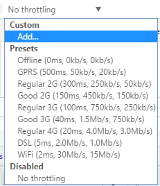

# Browser
> 浏览器

浏览器的两大核心是
- 渲染引擎，即内核，负责对网页语法的解释并渲染成网页内容、排版等
- JS引擎，是执行在一个线程里，不像其他语言那样多线程并可阻塞主线程，而是通过事件机制来解决。
- JS线程、工作线程、渲染线程之间的通信机制叫做事件循环EventLoop，其一是Call Stack宏任务，其一是Task Queue微任务，其执行流程是：
    - 工作线程完成异步任务，会把消息（注册时的回调函数）推到Task Queue中
    - 当Call Stack为空时，主线程从Task Queue取消息放入Call Stack来执行
    - 主线程一直重复前两步的逻辑直到消息队列为空

[WebKit is the web browser engine used by Safari, Mail, App Store, and many other apps on macOS, iOS, and Linux. ](https://webkit.org/)发展一个分支，支撑了现代浏览器的大部分功能，
chrome是Webkit的分支发展的，后来由于沙箱设计上产生冲突，逐渐发展成了Blink内核，脱离了Webkit。


## 认证与登录

CAS(Central Authentication Service)旨在为Web应用系统提供一种可靠的单点登录解决方法，属于Web SSO

SSO(Single Sign-On)是服务于企业业务整合的解决方案之一，SSO使得多个应用系统中，用户只需要登录一次，
就可以访问所有互相信任的应用系统。

## 缓存

浏览器会保存页面的特定的资源在硬盘上，

- images：picture，background，logos
- css
- html
- javascript

### 缓存位置

- Service Worker， 是运行在浏览器背后的独立线程，
- Memory Cache，资源缓存在内存中使用preloader技术，是优化页面的常见手段
- Disk Cache
- Push Cache

### 表单缓存
```javascript
document.yourFormName.reset();
```

### 资源缓存

#### 手动
对浏览器进行清除缓存

#### meta方法
```html
<meta http-equiv="pragma" content="no-cache">
<meta http-equiv="Cache-Control" content="no-cache, must-revalidate">
<meta http-equiv="expires" content="0">
```

#### 强制请求
资源文件后面添加一个随机参数，每次请求都不一样了，保证资源的最新
```html
<link rel='stylesheet' type='text/css' href='/css/file.css?t=222'>
<script src='/js/file.js?random=111'></script>
<div style='background:url(/path/resource/file.png?222'></div>
```

### 参考

- [深入理解浏览器缓存](https://www.jianshu.com/p/54cc04190252)
- [HTTP/2 push is tougher than I thought](https://jakearchibald.com/2017/h2-push-tougher-than-i-thought/)


## Chrome

[Chrome Devtools](https://developers.google.com/web/tools/chrome-devtools/open)

### waterfall
在console的Network中，waterfall可以直观来分析web页面加载的体验
1. 减少资源加载时间，瀑布图的宽度越窄越快
2. 减少请求数量，瀑布图高度越矮越好
3. 优化资源请求顺序，绿色部分是开始渲染页面

### network 

默认调整页面后，console会被清空，勾选**Preserve log**就可以保留

Online可以设置网速



### CEF

Chromium Embedded Framework(CEF)是一个框架，用于在其他应用程序中嵌入基于Chromium的浏览器。
嵌入式Chromium框架(简称CEF)，是一个基于Google Chromium的Webbrowser控件，支持用户插件，协议，JavaScript对象以及JavaScript扩展

- [CEF开发总结](https://www.pressc.cn/1042.html)

## 插件

- [ Next-gen framework for developing web extensions. ](https://github.com/wxt-dev/wxt)
    - [Read Frog - Open Source Immersive Translate | 🐸 陪读蛙 - 开源沉浸式翻译 ](https://github.com/mengxi-ream/read-frog)

## 参考

- [CAS实现SSO](http://www.coin163.com/java/cas/cas.html)

### 搜索
指定站点
xx site:http://jianshu.com
指定文件
xx filetype:pdf
不搜索指定域名
xx -csdn.net