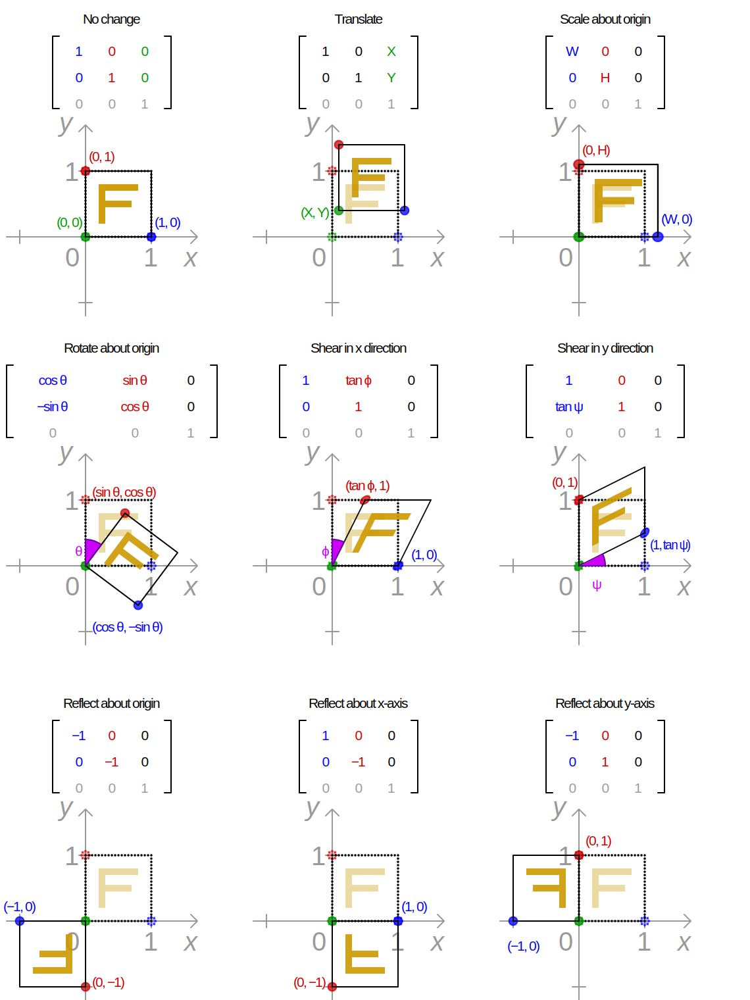

# Cascading Style Sheets

css本身就集成了非常丰富的功能，使用好CSS做出艺术级别的

## effect

### scroll

如果要是scroll起作用，一定是在子元素设置min-width,这样就会超出父元素，在父元素设置overflow-auto就可以有滚动条了。
是子元素冒出父元素，不是父元素使用子元素

### li 
横向摆放，使用float-left模式来处理

### box-shadow

```css
/* offset-x:1 offset-y:2 blur-radius:3 spread-radius:4 */
box-shadow: 0px 0px 1px 0px rgba(0,0,0,0.25);
```

### Cascading order - specificity
[CSS2-Cascading order](https://www.w3.org/TR/CSS21/cascade.html#specificity)
[css-cascade-4](https://drafts.csswg.org/css-cascade-4/#important)
[CSS Specificity And Inheritance](https://www.smashingmagazine.com/2010/04/css-specificity-and-inheritance/)关于CSS的权重问题，这个概念很复杂
注意selector尽量以 style-inline > id-select > class-selector > type-selector为思路， 重叠的selector是从上往下的，即最下面的效果是最终的，与html中的顺序无关, 但是可以使用!important来提高优先级。

```css
class1 {
    color: black;
}
class3 {
    color: red;
}
class2 {
    color: green !important;
}
<element class="class1 class2 class3">
```
结果是class2 > class3 > class1。

#### stacking context & z-index

上下文的堆栈顺序决定了最后显示的效果


### selectors选择器

#### combinators
组合器是用来解释选择器之间的关系, 在两个简单选择器之间插入一个组合器.
1. Adjacent Sibling:相邻,必须有相同的父元素,且必须是相邻的两个元素, 如`h2 + p`,所有跟着h2的p.
2. General Sibling:一般同级,有相同的父元素, 如`p ~ span`,匹配所有跟着p的元素
3. Child:孩子,如`div > p`div中第一级的p,对比后代的区别.
4. Descendant:后代,如`div p`div中所有的p

#### pseudo classes & elements
如`a:visited`匹配所有已经被访问的a的tag element `p::first-line`匹配所有p的第一行

#### box-model

浏览器的render engine渲染引擎把element当成一个长方形,css决定这些长方形的大小,位置和属性. 如果只有默认样式,element是在普通流中占一个位置,而位置所占大小由长方形模型来决定. 每个长方形模型是受如图中所描述的边距影响的.

box-model分为两类:块状block和行内inline,两种的区别:

1. block可以设置width,height,而inline设置无效
2. block独占一行,除非修改了element的样式,而inline只会在一行内显示
3. block的width默认100%,而inline是根据element内容及element-child来决定

##### position

1. **Normal Document Flow普通流**,指的是HTML代码的位置从上往下决定了element的位置;
2. **relative相对定位**指element相对于**普通流**做了偏移;如果z-index不是auto,则产生新的**stacking context**
3. **absolute绝对定位**,从**普通流**中移除,由距离它最近的**ancestor element**相对定位, 如果z-index不是auto,则产生新的**stacking context**
4. **fixed固定定位**,从**普通流**中移除,由**screen viewport视窗口**相对定位,不受滚动影响.总是产生新的**stacking context**
5. **float浮动**,从**普通流**中移除,特点:
    1. 只有横向浮动,不能纵向浮动
    2. 其parent-element得不高度
    3. element的display更改为block
    4. 浮动的前一个element不受影响,后一个element会围绕,如典型的文字围绕图片

#### break word

1. **word-break**: 允许单词在任何地方被打破(强行折断换行),本质上,break-all是将非CJK当作CJK文字处理, keep-all是反向的,将CJK当作非CJK.
2. **line-break**: The line-break CSS property is used to specify how (or if) to break lines when working with punctuation and symbols. This only affects text in Chinese, Japanese, or Korean (CJK)

#### @media

语法
```
@media mediatype and|not|only (media feature) {
    css-code;
}
<link rel="stylesheet" media=mediatype and|not|only (media feature)" href="customcss.css">
```

### transform

视觉格式模型[visual formatting model](https://www.w3.org/TR/CSS22/visuren.html)

#### matrix
```javascript
// Cartesian Homogeneous Coordinate
// CaC  HC on RP^2 		CaC on R^3 		HC on RP^3
// a c  a c tx          a b tx			a c 0 tx
// b d  b d ty		    b d ty			b d 0 ty
//      0 0 1			0 0 1			0 0 1 0
//      [a b c d tx ty]					0 0 0 1

```

CSS Generator - Matrix Transform
CSS Transform property allows to scale, rotate, skew and move HTML elements.

1) Scale - resize elements(small or bigger)
2) Rotate - by angle about the origin
3) Skew - transformation along the X or Y axis
4) Translate - move element in XY direction

linear transformations also can be represented by Matrix function. It combine multiple transform properties into single matrix function. Thanks to this wikipedia image which makes clear everything about matrix transformation.



## Tools

### WebAIM:web accessibility in mind
- [Color Contrust Check](https://webaim.org/resources/contrastchecker/) 

## Visual formatting model
it is an algorithm that processes a document and display it on visual media.
it transforms each element of the document and generates zero, one, or several boxes that conform to the **box model**


## [Sass](https://www.sasscss.com/)

Syntactically Awesome StyleSheets
语法格式有两类

- SCSS，Sassy CSS，仅在CSS3基础上扩展，文件后缀为.scss
- Sass，Indented Sass，使用“缩进”代替“花括号”，用“换行”代替“分号”，文件名后缀为.sass

[scss doc](https://www.sasscss.com/documentation)


[参考使用方法](https://github.com/lmj01/startbootstrap-grayscale)

[boots-watch](https://bootswatch.com/)的demo展示了主体样式切换的原理，就是css文件的替换后自动刷新。它利用了scss预处理技术，把bootstrap中的变量进行了替换，和一些基本样式的更改，


## 参考

- [css 3d transforms](https://polypane.app/css-3d-transform-examples/)


