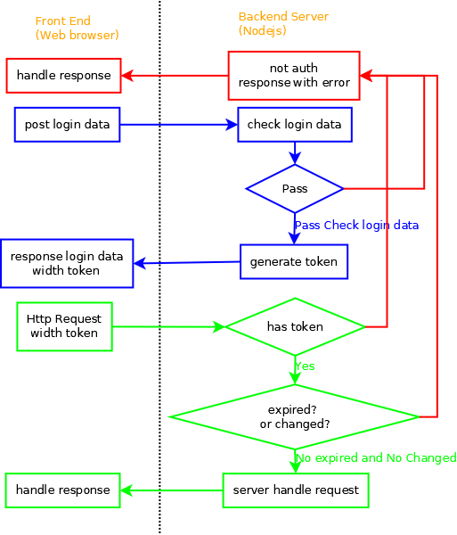

# web

## API

### OPFS文件系统

- [Web 文件系统（OPFS 及工具）介绍](https://hughfenghen.github.io/posts/2024/03/14/web-storage-and-opfs/)

## 认证机制

目前可参考的方案

- session与数据库配合
    - 很多框架使用的方案,比较老旧，前后端未分离前的主流方案
    - 利用cookie存储与后端的session，需要每次做判断
- token
    - 有点类似客户端的心跳包一样，登录后给信任权，自由度更高
    - token在后台可不存储，只需判断是否过期或被篡改否
    

### 跨域隔离(Cross Origin Isolation)

```html
<script src="a.js" crossorigin></script>
<!--  -->
<!-- cross-origin-resource-policy:cross-origin -->
```
// 使用*允许所有域名，或者只允许你需要的域名，只能写一个域名，不能有通配符，如有多个域名可通过脚本控制返回
Access-Control-Allow-Origin:https://www.example.com


## 记住密码

做网站时会碰到要实现记住密码，下次自动登录，一周内免登录等这种需求，一般都是通过cookie来实现的。用户成功登录后，存储一个实现自动登录的cookie数据到数据库，作为下次登录时验证使用，验证通过就自动登录，否则需要输入用户名和密码进行登录。
