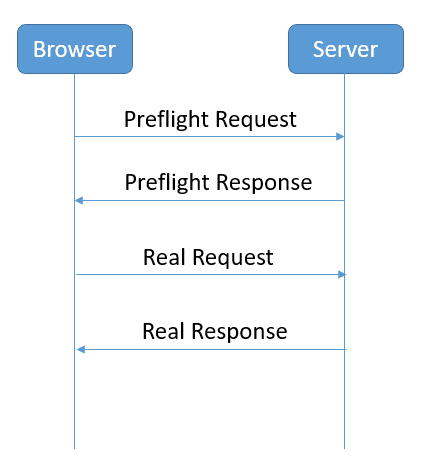

# web

## 库与框架

- **[Flows](https://flow.org/en/)**: A static type checker for javascript, Vue中有使用到
- [PeerJS](https://peerjs.com/)PeerJS wraps the browser's WebRTC implementation to provide a complete, configurable, and easy-to-use peer-to-peer connection API.
- [WAPM](https://wapm.io/) is the WebAssembly Package Manager
- [jsbin](https://github.com/jsbin/jsbin)协作式的简单web开发环境，方便调试
- [Color Contrust Check](https://webaim.org/resources/contrastchecker/) 
- [pure](https://purecss.io/menus/): A set of small, respeonsive CSS modules that you can use in every web project.

## 跨域

前后端分离带来的CORS问题， 因为浏览器的同源策略造成的，是浏览器对JavaScript的安全限制，而所有的浏览器都实行同源策略， 同源是指

- 协议相同
- 域名相同
- 端口相同

解决方案有

- 后端设置http Access-Control-* 相关响应头
- Jsonp，利用浏览器对script加载完自动执行的特性来实现的，需要客户端和服务端两端的同时配合，对接口做特殊处理，后台的兼容性较差
- 通过nginx反向代理，利用代理转向传输数据
- cors

[CORS wiki](https://www.w3.org/wiki/CORS)是一种w3c标准[CORS-preflight fetch](https://fetch.spec.whatwg.org/#cors-preflight-fetch)， 全称是跨域资源共享Cross-origin resource sharing

前端请求会产生错误Response to preflight request doesn't pass access control check:
关键字是preflight预检请求， 浏览器将cors分为两类：simple request简单请求和not so simple request非简单请求

简单请求满足以下条件就是：

- 请求方法是只能是以下字段之一：GET POST HEAD
- Http的头信息不超出以下字段：Accept Accept-Language Content-Language Last-Event-ID Content-Type。其中Content-Type只限于三个值
    - application/x-www-form-urlencoded
    - multipart/form-data
    - text/plain

其他都是非简单请求。 **如果头信息中的Content-Type不设置，默认为json/application，即非简单请求，即预检请求**

浏览器对请求的处理是：

如果是简单请求，一次完整的请求过程是不需要服务端预检的，直接响应客户端

非简单请求，浏览器在在发送真正的请求之前先用OPTIONS发送一次预检请求reflight request，从而获知服务端是否允许跨域请求，当服务器确认后，才会发起真正的请求。

这里用koa2-cors 

## 业务逻辑

### 认证机制

目前可参考的方案

- session与数据库配合
    - 很多框架使用的方案,比较老旧，前后端未分离前的主流方案
    - 利用cookie存储与后端的session，需要每次做判断
- token
    - 有点类似客户端的心跳包一样，登录后给信任权，自由度更高
    - token在后台可不存储，只需判断是否过期或被篡改否
    

### 记住密码
做网站时会碰到要实现记住密码，下次自动登录，一周内免登录等这种需求，一般都是通过cookie来实现的。用户成功登录后，存储一个实现自动登录的cookie数据到数据库，作为下次登录时验证使用，验证通过就自动登录，否则需要输入用户名和密码进行登录。

## 术语

- SSR-Server Side Render
- CSR-Client Side Render
- XSS 跨站脚本攻击
